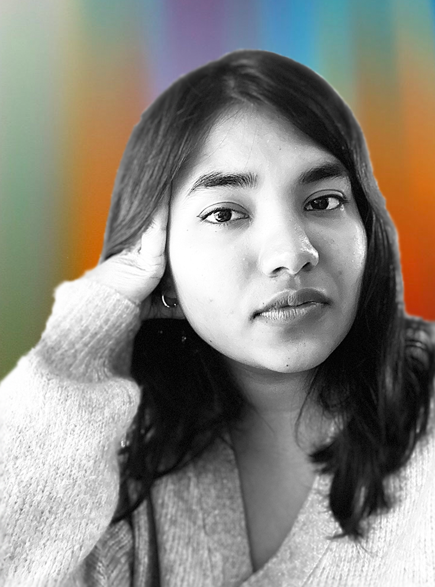

# **About**

Hello there! Welcome to my digital design space.
I am Seher Krishna, from Bangalore, India.
As a designer, I am inclined towards projects that focus on brand identity, service design, and user research.
During my free time, I spend it trying out new recipes, taking care of my plants, and occasionally, I play the piano.
I have a B.Des(Communication Design) from Kingston University, London after studying at IIAD, New Delhi. After working for 2 years in the service sector for a cheese company where I wore many hats (graphic designer + social media marketing + packaging + branding + product photography), I worked for a signage and way-finding design firm. I felt like i wasn't up-skilling after a point and my work didn't challenge me as much, I found this master's course at IaaC that seemed like just what I needed! I'm very pumped to be here and can't wait to see where this year takes me. &#9786;

**[Emergent Futures](https://emergent-futures.mn.co/feed)**
