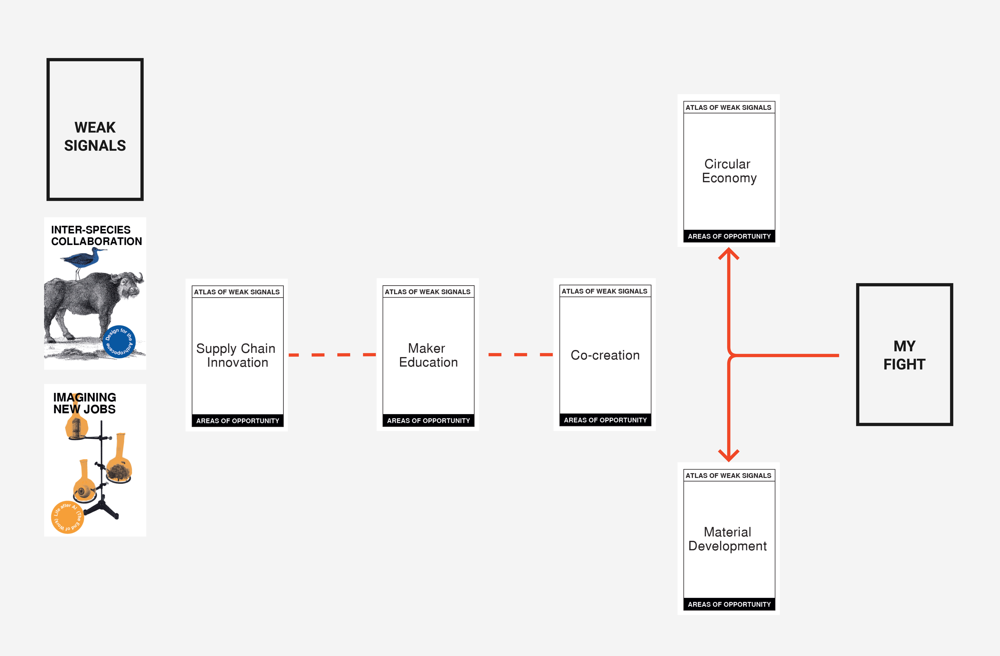
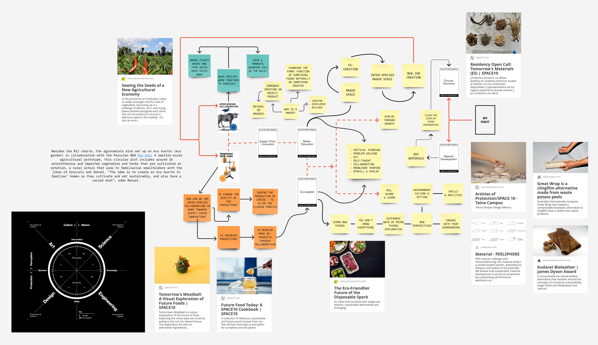
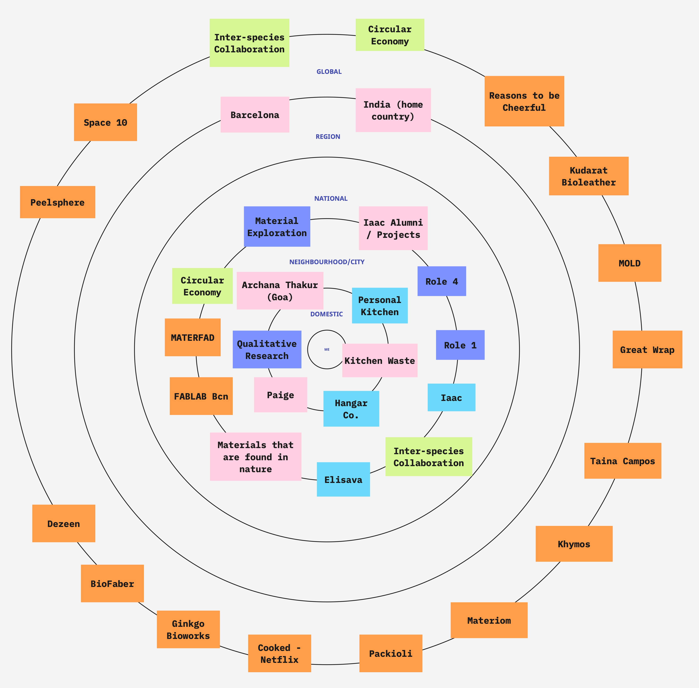
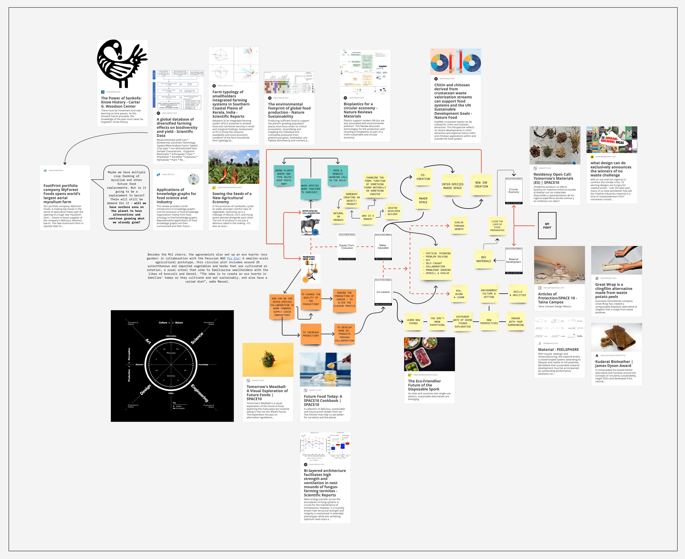
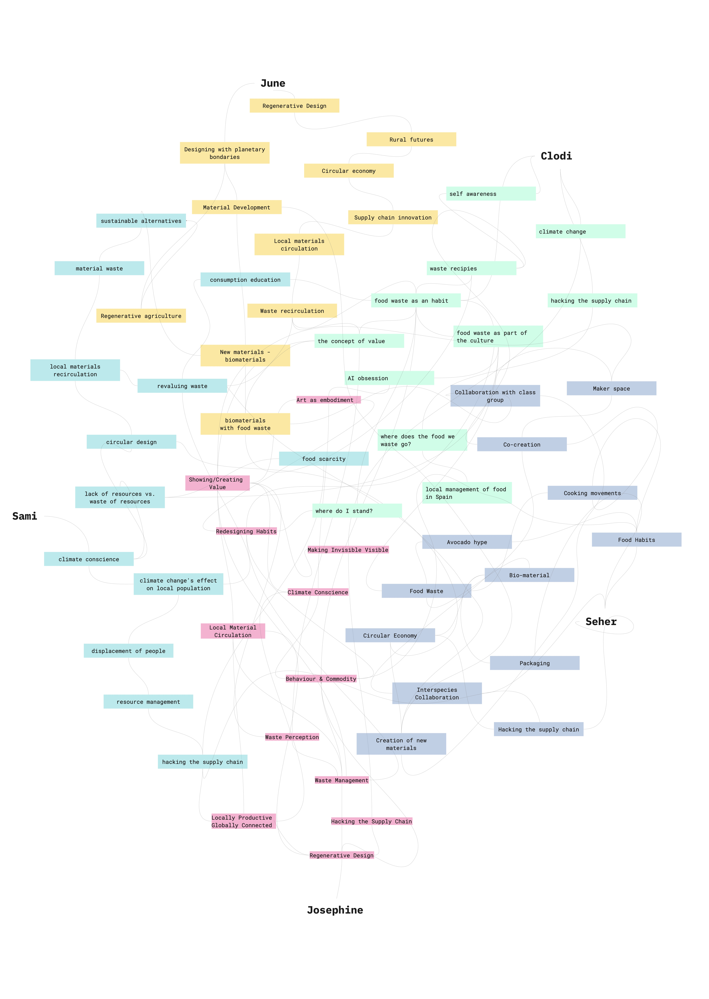
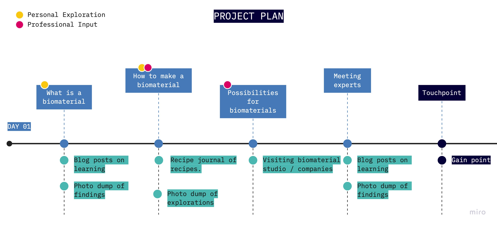
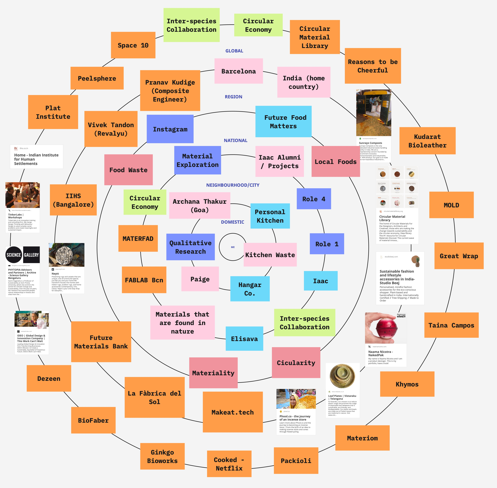
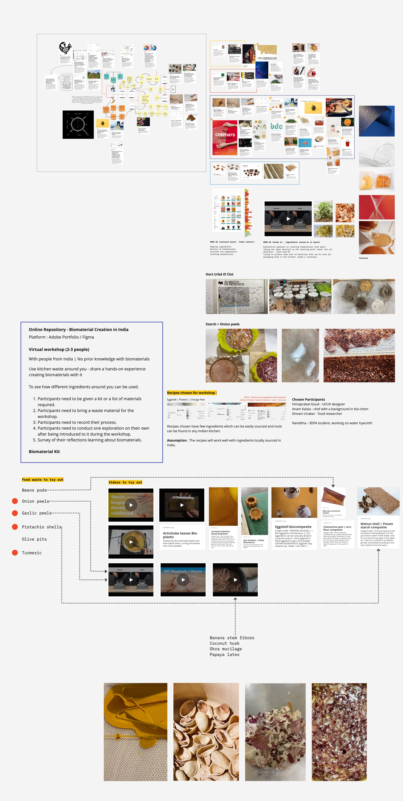
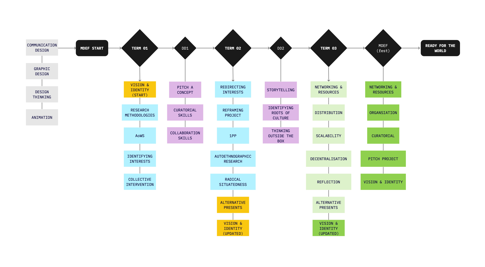

---
hide:
    - toc
---

# Design Studio Process (2022-2023)

<h3>Introduction to Atlas of Weak Signal cards</h3>

<h3>Beginnning of creating my Design Space</h3>

<h3>Multiscalar Perspective</h3>

<h3>Updated Design Space</h3>

<h3>Intersecting Weak Signals for Collaborative Project</h3>

<h3>Project Planning</h3>

<h3>Updated Multiscalar Perspective</h3>

<h3>Updated Design Space</h3>

<h3>Journey through MDEF</h3>

