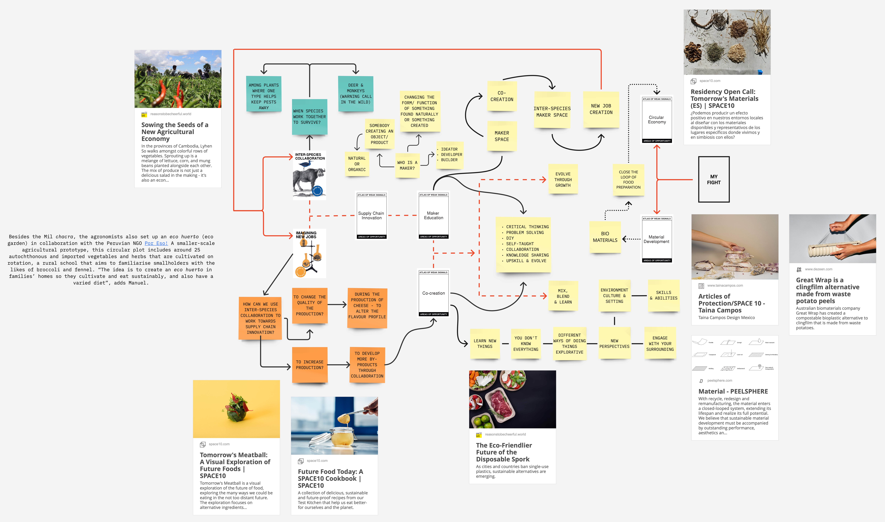

---
hide:
    - toc
---

# Atlas of Weak Signals

**Atlas of weak signals**

The week began with a fun exercise with the atlas of weak signal toolkit. I decided to go forward with the cards I go my through a blind draw as I felt I could make a connection with the 5 cards - 2 weak signals and 3 areas of opportunity and my fight. The cards I deleted from the deck to represent my fight were - circular economy and material development. The area I want to explore is biomaterial. I’m interested in learning to create new materials using waste that is generated during food production and food processing. Focusing on developing new packaging solution that are sustainable while keeping the context in mind. Many cultures follow principles of preparation where the whole ingredient is used. While cooking fish, the fillet is grilled and the remaining fish including the bones and tail is used to make a stock. A country like India used ingredients like tamarind, onion, pumpkin and different gourds for many recipes that are generational. The preparation process often results in parts of the vegetable to be discarded. If these could converted to materials that could be used to eat/ pack/ transport the food, this might make the way we consume more circular.

