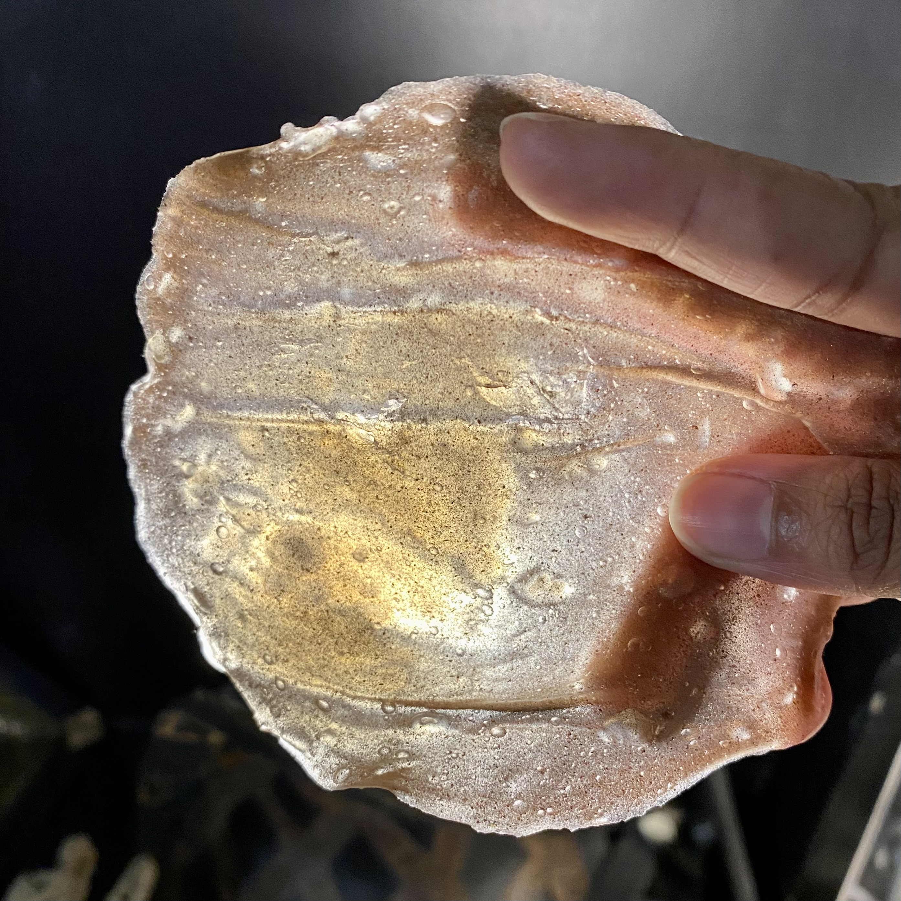

---
hide:
    - toc
---

# **Bio Zero**

**Scientific Review**

Article link - 
Other - 

<h1>Article Link</h1>
    <iframe src="https://www.embopress.org/doi/epdf/10.15252/embr.201540128">
    </iframe>

I have selected to review an article from EMBO reports for this
assignment. The article titled ‘Science for food’ talks about how
molecular biology contributes to the production and preparation of
food. Written by Howard Wolinsky & Kristofor Husted, the article
looks at various aspects of GMO, 3D printed food, food production
alternatives and altercation that exist and how the role they
could play in the near future. In most popular cooking shows and
food documentaries like Chef’s Table, Masterchef Australia or
others like Salt Fat Heat Acid, you see chefs experimenting with
molecular techniques and food chemistry. Heston Blumenthal is a
known for his scientific approach towards cooking. Food
preparation is going to be influenced and adapt to meet future
requirements through the influence of chemistry and biological
modifications. The elephant in the room is still going to be, how
this can become mainstream and reach the masses. Enzymes like
‘transglutaminase’ is used by professional chefs to bind different
meats together and achieve creative food challenges. While people
working in the food service sector might use it to cut costs or
increase shelf-life. On one hand, in the supermarket or as a pizza
topping, you might not know the quality or composition of the meat
you are consuming. High-end restaurants would market their dish
and state the method of preparation, there is a certain level of
transparency. William Meyers, executive chef at the Stone Harbour
Golf Club talks about the advantages of using meat glue. He is
able to prepare dishes for diners with delicate digestive systems
or those who are gluten intolerant, as the enzyme acts as a binder
and replaces the use of flour. He goes on to talk about the
chemical tapioca maltodextrin which has has the ability to turn
any liquid fat into a powder. By using this powdered fat, chefs
are able to enhance complex flavour profiles into the dish while
adding a theatrical effect to a dining experience. A common
example of this would be a waiter mixing sodium citrate and warm
beer to a wheel of aged cheese and achieving a velvety melted
cheese effect to pour over a burger or maybe a bowl of pasta. Food
producers and especially wine makers are looking for news methods
to infuse scientific reactions to tackle climate change, resource
depletion, water conservation, reduced soil health, infestation of
invasive species. Researchers are looking towards genetically
tinkering with micro-organisms to adapt them to meet our demands
daily but to quote Howard Wolinsky that “...it is the application of
science in agriculture that will enable farmers to feed a world
population of 9.5 billion”. The world needs to work towards
developing technologies to decrease energy consumption, air and
water pollution and wastage of resources in the food production
and preparation sector. Our time and money must be re-evaluated in
terms of what areas we should be focusing on. Farming and
ecological practices should be borrowed from our ancestors and
combined with new-age technology to work towards a circular
economy. A new world where the the creation of by-products are put
back into the system and utilised to feed into another process.
This in turn will help fight problems of climate change, resource
depletion and infestation of invasive species. A paper on Research
Gate titled, Development of an Agricultural Biomaterial Industry
in Ontario by Aung Oo, Nafis Muntasir, Kenneth Poon, Alfons
Weersink, and Mahendra Thimmanagari talks about food and
agricultural in terms of a biomaterial resource for an economy.
They have studied and analysed data collected in Ontario and
looked at how biofarms for biomass collection have been
implemented. The effect on the nation’s economy and where there is
a scope to use biomaterials from agriculture biomass in various
production lines. We should look towards other nations that are
developing new materials and collaborate and share methodologies
on moving towards a highly efficient and self-sufficient way in
growing and consuming food.
