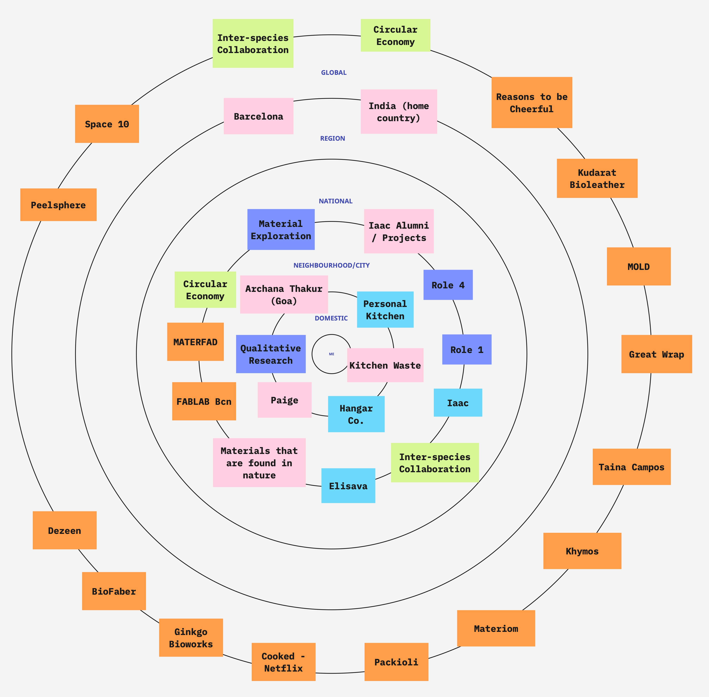

---
hide:
    - toc
---

# **Design Studio**

During my undergrad, I have used various tools for collecting data. Prototype 01 where the prototype is a means of inquiry was used. In order to create user personas, questionnaires were developed, the needs, wants and desires of individuals were charted out. Analysing the data collected is imperative in design for others. One needs to understand the consumer / end used of the product or system. I have also used Prototype 04, as a vehicle for inquiry. I created a delivery box for cooking ingredients and fresh produce. The aim of creating the prototype was to understand how the components could be packed and delivered without any damage while still being experiential to the consumer upon receiving it. I have used methodolgies like SWOT analysis, vision mission values, user mapping and created drafts for business proposals. I plan to combine Prototype 04 and 01 and experiment with different types of waste to better understand the materials and their characteristics. The bioplastics activity in class helped me begin this journey towards creating new materials.
I have identified someone who runs a biomaterials packaging company back in India who can guide me a little with future possibilities in my home country. Paige has offered to conduct a small workshop on creating biomaterials in class, really looking forward to that. The bio lab at Elisava and my class room at Iaac, along with my kitchen in my dorm room will be my local workspace and consists of people who can guide me. While my materials will extend beyond my immediate surrounding.

