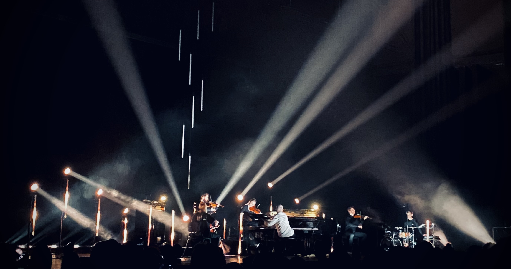

---
hide:
    - toc
---

# **Tech Beyond the Myth**

<h3>Unpacking Intelligent Machines</h3>
<h3>An introduction to physical computing by hacking everyday objects</h3>

<a class="button" href="https://hackmd.io/xQ9hjQftSiaee3XNQ7NcrQ?view">Drip Coffee Maker</a>

  <iframe loading="lazy" style="position: absolute; width: 100%; height: 100%; top: 0; left: 0; border: none; padding: 0;margin: 0;"
    src="https:&#x2F;&#x2F;www.canva.com&#x2F;design&#x2F;DAFSOM00dx4&#x2F;view?embed" allowfullscreen="allowfullscreen" allow="fullscreen">
  </iframe>

<a href="https:&#x2F;&#x2F;www.canva.com&#x2F;design&#x2F;DAFSOM00dx4&#x2F;view?utm_content=DAFSOM00dx4&amp;utm_campaign=designshare&amp;utm_medium=embeds&amp;utm_source=link" target="_blank" rel="noopener">BUBBLE MAKER</a> Open in New Tab

<iframe width="560" height="315" src="https://www.youtube.com/embed/yP4Ky6ruQYY" title="YouTube video player" frameborder="0" allow="accelerometer; autoplay; clipboard-write; encrypted-media; gyroscope; picture-in-picture" allowfullscreen></iframe>

During this module, I found the introductory sessions about the theories surrounding technology extremely interesting. After watching shows like 'The Social Dilemma' and 'Black Mirror', the need for discussing and immersing ourselves in these topics has never been more crucial. The system that connects us also invisibly controls us. By throwing ourselves into opening up devices and gadgets, the fear of being controlled by technology lessened. I have never done something as techie as this before and for me, it really pushed me out of my comfort zone. When we began working as a group to create an almost useless machine, I found that i enjoyed the building part and working with my hands. I began feeling more confident being around the machines in the FabLab. There were some heavy machinery that I was too short to use, but I instead used that opportunity to see how the machine works from up close. According to me, this module was challenging and highly engaging and I felt super proud of my group when we managed to blow our first bubble, using the machine; in-front of our peers and teachers. It was a moment of tension but relief at the same time and we pulled it off by playing off of each other's strengths. I recently went for a concert  by Ólafur Arnalds, this was the first time I was hearing music by this Icelandic artist. It seemed as though certain notes, when played on the different instruments like the piano, cello, violins and drums would trigger parts of the light installation. The stage design seemed like an a breathing, living machine that transported me to various emotions across the performance. This module has helped me in being able to break down larger concepts and identify parts where technology and Arduino may have been used.

© Sunny Chopda

