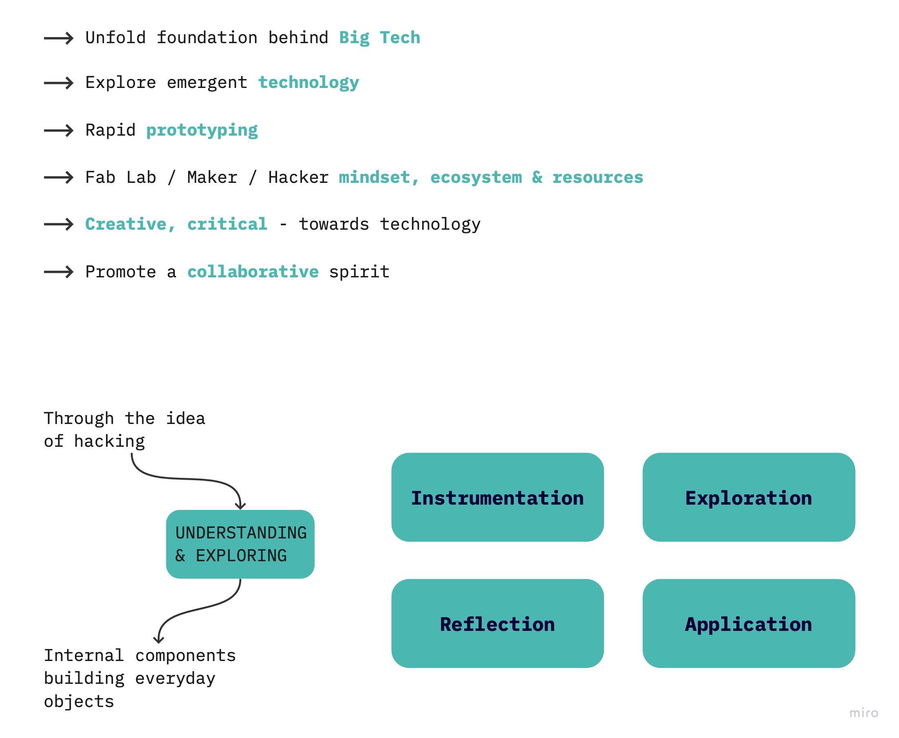

---
hide:
    - toc
---

# **Tech Beyond the Myth**

<h3>Unpacking Intelligent Machines</h3>
<h3>An introduction to physical computing by hacking everyday objects</h3>

<a class="button" href="https://hackmd.io/xQ9hjQftSiaee3XNQ7NcrQ?view">Drip Coffee Maker</a>

  <iframe loading="lazy" style="position: absolute; width: 100%; height: 100%; top: 0; left: 0; border: none; padding: 0;margin: 0;"
    src="https:&#x2F;&#x2F;www.canva.com&#x2F;design&#x2F;DAFSOM00dx4&#x2F;view?embed" allowfullscreen="allowfullscreen" allow="fullscreen">
  </iframe>

<a href="https:&#x2F;&#x2F;www.canva.com&#x2F;design&#x2F;DAFSOM00dx4&#x2F;view?utm_content=DAFSOM00dx4&amp;utm_campaign=designshare&amp;utm_medium=embeds&amp;utm_source=link" target="_blank" rel="noopener">BUBBLE MAKER</a> Open in New Tab

<iframe src="https://drive.google.com/file/d/1P7UgAP8n79RO4PPG3IvjOdn25TaRQLOt/preview" ></iframe>

<!--aloow full screen add tag -->

<iframe allowfullscreen="allowfullscreen" src="your_page_url/preview" ></iframe>
