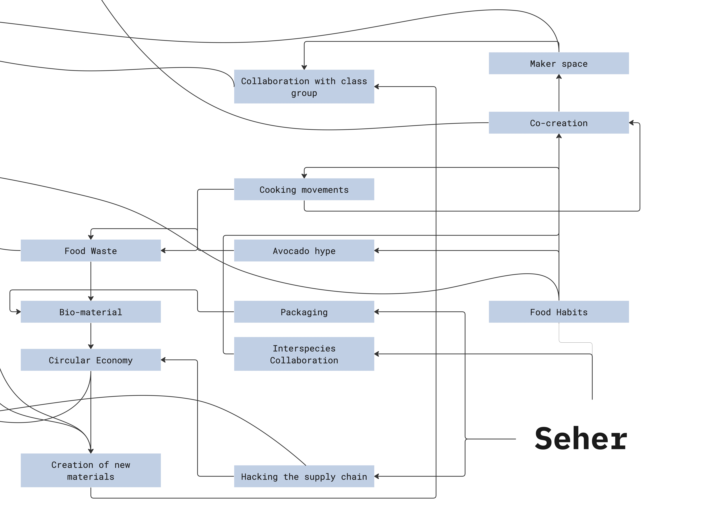
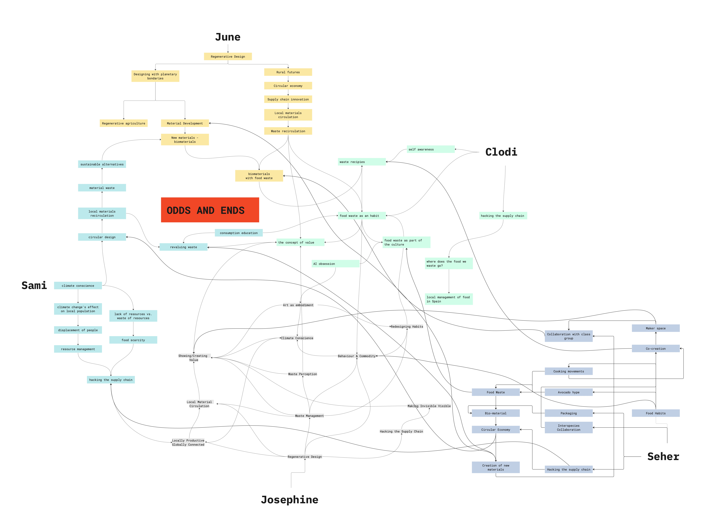

---
hide:
    - toc
---

# **Community Engagement**

<h3>Mapping</h3>

<h3>Initial Direction</h3>

<i>In a sense, my first intervention was during the 'Living with your own ideas' module where I was interested in exploring how cultural cooking practices define our food waste production. This led me towards wanting to work with food waste in the area of generating new materials.</i>

<iframe src="https://player.vimeo.com/video/767908279?h=b2821e86cf&amp;badge=0&amp;autopause=0&amp;player_id=0&amp;app_id=58479" frameborder="0" allow="autoplay; fullscreen; picture-in-picture" allowfullscreen style="position:absolute;top:0;left:0;width:100%;height:100%;" title="Seher_Cooking_Habits.mp4"></iframe>

<h3>Intervention 01</h3>

  <iframe loading="lazy" style="position: absolute; width: 100%; height: 100%; top: 0; left: 0; border: none; padding: 0;margin: 0;"
    src="https:&#x2F;&#x2F;www.canva.com&#x2F;design&#x2F;DAFTg__L2MQ&#x2F;view?embed" allowfullscreen="allowfullscreen" allow="fullscreen">
  </iframe>

<a href="https:&#x2F;&#x2F;www.canva.com&#x2F;design&#x2F;DAFTg__L2MQ&#x2F;view?utm_content=DAFTg__L2MQ&amp;utm_campaign=designshare&amp;utm_medium=embeds&amp;utm_source=link" target="_blank" rel="noopener">FOOD NOT BOMS</a> by June Bascaran Bilbao

<i>Cooking dinner with the 'Food not Bombs' collective helped us look at the waste that is still generated by using left over produce from supermarkets. Noticing how they were spending money on takeaway parcels that were not biodegradable, made us want to explore working with waste even more.</i>

<h3>Exploration</h3>
<iframe width="560" height="315" src="https://www.youtube.com/embed/J54PSsGmIxs" title="YouTube video player" frameborder="0" allow="accelerometer; autoplay; clipboard-write; encrypted-media; gyroscope; picture-in-picture" allowfullscreen></iframe>

<i>Having only explored creating bioplastics during the short Bio & Agri zero module, I had very little prior knowledge in this area. I felt quite lost as to where to begin, but luckily I had already started collecting my avocado seeds. By seeing what kind of textures other people had achieved using a variety of materials at Materfad, within my group of friends in MDEF ; I was keen to go for it.

I had quite a few problems trying to crush the avocado pits in the FabLab but in the process I learnt how to open up the big machine and clean it.

I prototyped a cover for the hand-blender in the BioLab to eventually get around the issue.
I began the process with following the steps of the recipes I had found online but the variables involved were crazy. My first day of exploration, I placed the materials in the dehydrator to dry but they cracked. The obvious reason was because my recipe largely consisted of H2O. I began feeling a bit more confident after I made a material that seemed to hold its shape. But as the days passed, the material continued to shrink! I decided to experiment with the ratios and all the different materials I had used in the past recipes and create my own. It turned out quite nice as it was the most colourful, multi-textural and I found that I used the most avocado pit material in this one. It was great working along side by group in the BioLab as even though we were doing our own materials, we were very involved in the process of each-others. So I got more out of the exploration experience. I think I would like to work further on materials from kitchen waste but towards creating materials that are more thin, involve older techniques of making materials (less equipment and technology).</i>

<h3>Other</h3>

<iframe width="560" height="315" src="https://www.youtube.com/embed/4GvadeXuzXQ?start=19" title="YouTube video player" frameborder="0" allow="accelerometer; autoplay; clipboard-write; encrypted-media; gyroscope; picture-in-picture" allowfullscreen></iframe>
