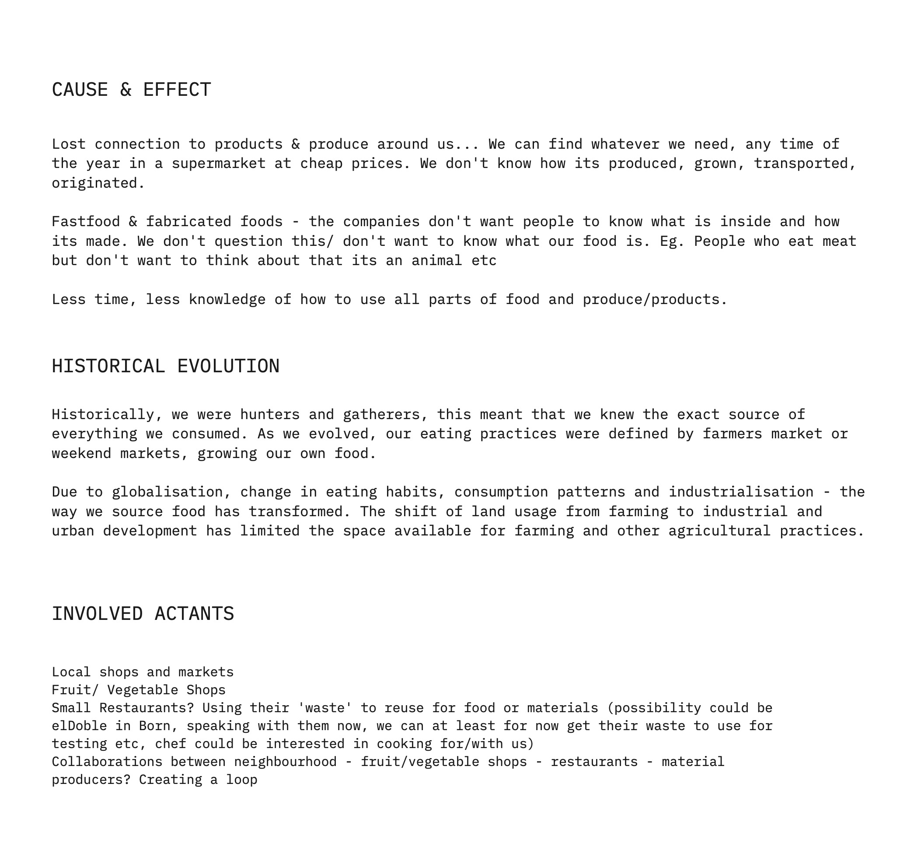

---
hide:
    - toc
---

# **Community Engagement**

<h3>Mapping</h3>

<h3>Intervention 01</h3>

<i>In a sense, my first intervention was during the 'Living with your own ideas' module where I was interested in exploring how cultural cooking practices define our food waste production. This led me towards wanting to work with food waste in the area of generating new materials.</i>

<iframe src="https://player.vimeo.com/video/767908279?h=b2821e86cf&amp;badge=0&amp;autopause=0&amp;player_id=0&amp;app_id=58479" frameborder="0" allow="autoplay; fullscreen; picture-in-picture" allowfullscreen style="position:absolute;top:0;left:0;width:100%;height:100%;" title="Seher_Cooking_Habits.mp4"></iframe>

<h3>Intervention 02</h3>

  <iframe loading="lazy" style="position: absolute; width: 100%; height: 100%; top: 0; left: 0; border: none; padding: 0;margin: 0;"
    src="https:&#x2F;&#x2F;www.canva.com&#x2F;design&#x2F;DAFTg__L2MQ&#x2F;view?embed" allowfullscreen="allowfullscreen" allow="fullscreen">
  </iframe>

<a href="https:&#x2F;&#x2F;www.canva.com&#x2F;design&#x2F;DAFTg__L2MQ&#x2F;view?utm_content=DAFTg__L2MQ&amp;utm_campaign=designshare&amp;utm_medium=embeds&amp;utm_source=link" target="_blank" rel="noopener">FOOD NOT BOMS</a> by June Bascaran Bilbao

<i>Cooking dinner with the 'Food not Bombs' collective helped us look at the waste that is still generated by using left over produce from supermarkets. Noticing how they were spending money on takeaway parcels that were not biodegradable, made us want to explore working with waste even more.</i>

<h3>Intervention 03</h3>
