---
hide:
    - toc
---

# **Extended Intelligences**

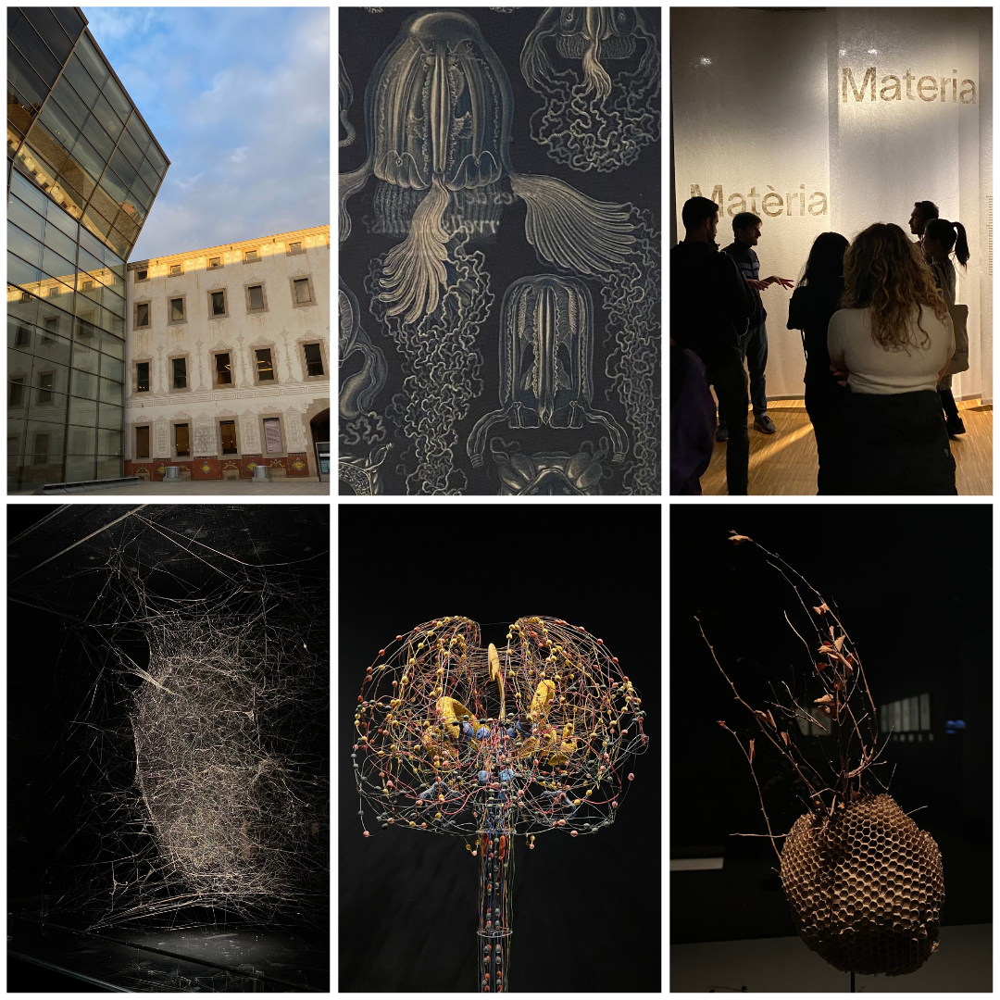

<i>What is the difference between a person and a machine? Where is the line between a child and a doll, between the animate and the inanimate, in other words, between life and death?</i> <h3>- Gaby Wood</h3>

  <iframe loading="lazy" style="position: absolute; width: 100%; height: 100%; top: 0; left: 0; border: none; padding: 0;margin: 0;"
    src="https:&#x2F;&#x2F;www.canva.com&#x2F;design&#x2F;DAFUfgToJPA&#x2F;watch?embed" allowfullscreen="allowfullscreen" allow="fullscreen">
  </iframe>

We discussed the foundational understanding of AI(tools and ethics of it) and machine learning. We explored how one can construct applications to challenge these. Intelligence can be classified under some main categories like-
a. Cultural Intelligence (storytelling & community)
b. Emotional Intelligence
c. Other

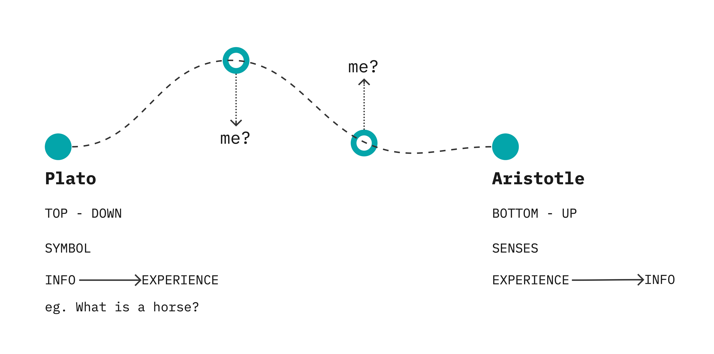

SYMBOL: innate responses eg. a snake (a cat will interpret a cucumber as a snake)

GOAL ORIENTED vs. JUST EXPERIENTIAL

Intelligence: Specific functioning, symbol processing, information integration, motor complex skills & languages, etc.

<h3><i>How do you define intelligence?</i></h3>

SYMBOL GROUNDING PROBLEM (semiotics)
<i>how something is - how something connects or corresponds to it.</i>

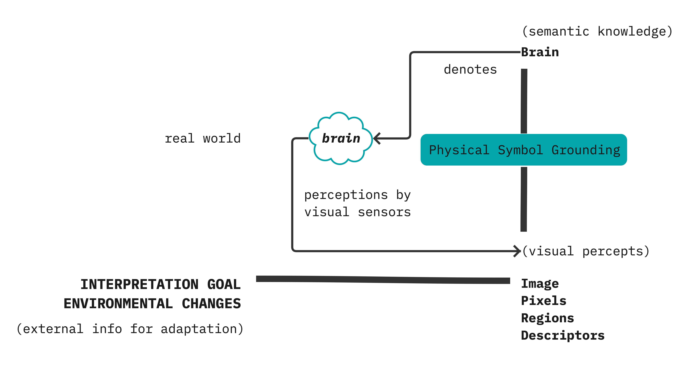
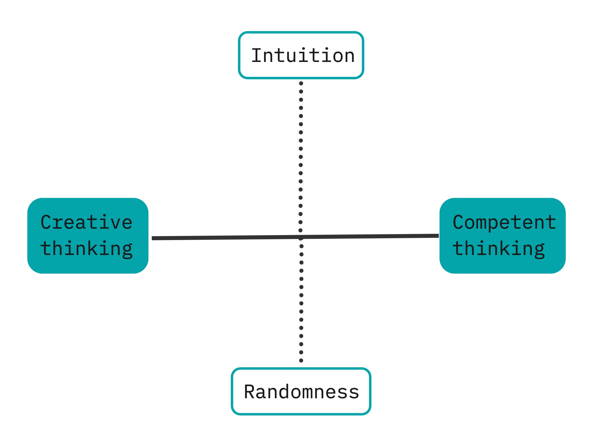
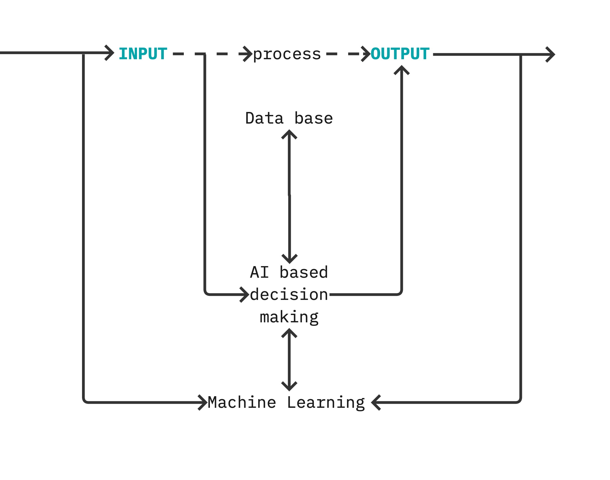

Rational agent - will always choose the options by looking at the information it has, and the state it is in with its intelligence and choose which it can reach the goal faster.

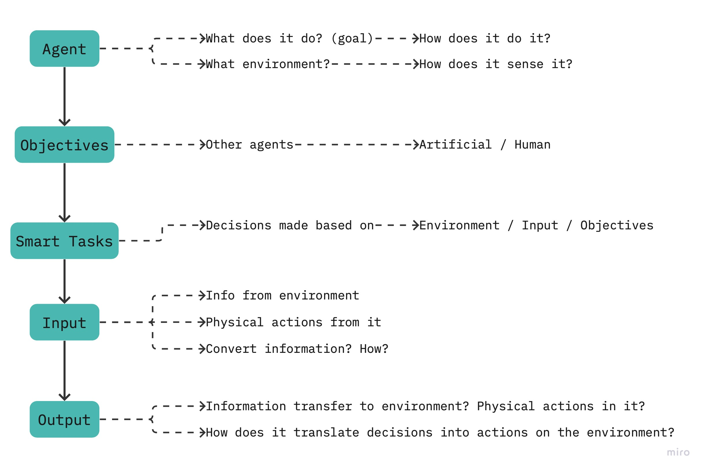
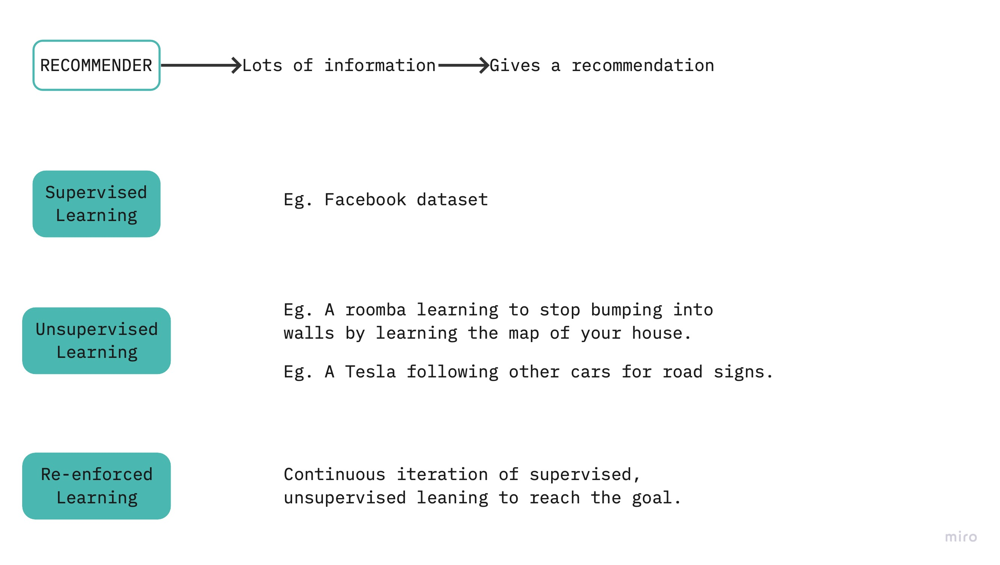

<h2><b>"There is nothing as subjective as data".</b><h5>How you measure, what you measure is a decision.</h2>

Cluster - measure of similarity b/w objects
Similarity - closer to which side?
Centroid - center of a cluster

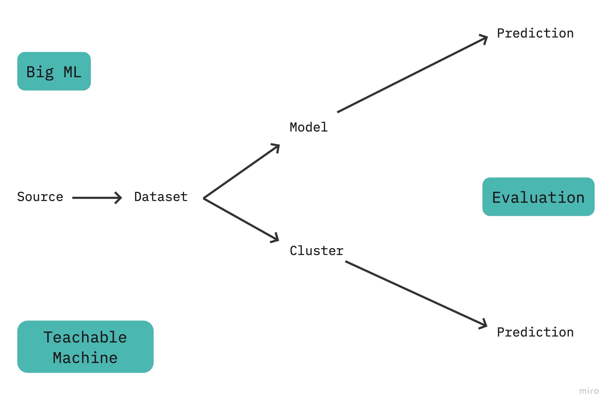
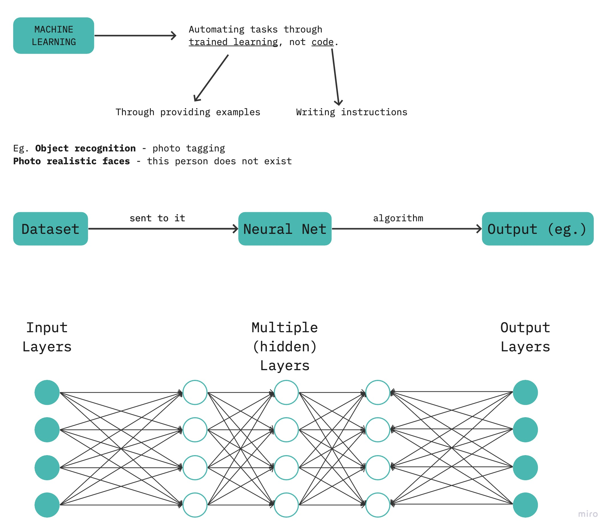
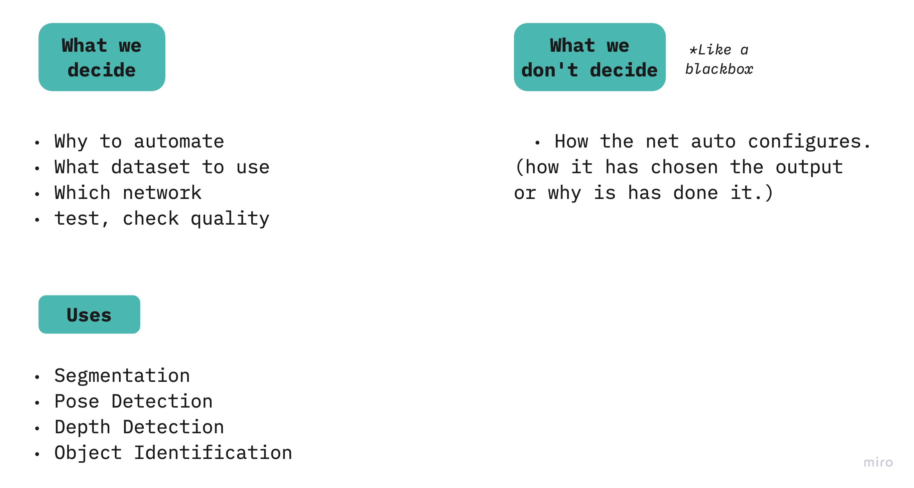
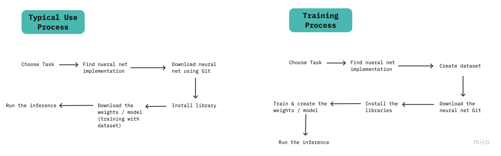

Compulsive Intelligence - AI
Confidence Threshold - at what % is it sure of a label. Eg. 80% person | 5% cat

<iframe width="768" height="432" src="https://miro.com/app/live-embed/uXjVP-R60lM=/?moveToViewport=-1920,-1610,3373,2766&embedId=89964868079" frameborder="0" scrolling="no" allowfullscreen></iframe>

  <iframe loading="lazy" style="position: absolute; width: 100%; height: 100%; top: 0; left: 0; border: none; padding: 0;margin: 0;"
    src="https:&#x2F;&#x2F;www.canva.com&#x2F;design&#x2F;DAFUEu4fxrk&#x2F;view?embed" allowfullscreen="allowfullscreen" allow="fullscreen">
  </iframe>

  <iframe loading="lazy" style="position: absolute; width: 100%; height: 100%; top: 0; left: 0; border: none; padding: 0;margin: 0;"
    src="https:&#x2F;&#x2F;www.canva.com&#x2F;design&#x2F;DAFUQsaPo_0&#x2F;view?embed" allowfullscreen="allowfullscreen" allow="fullscreen">
  </iframe>

