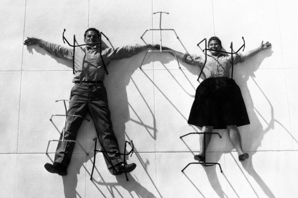
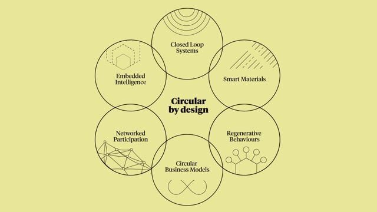
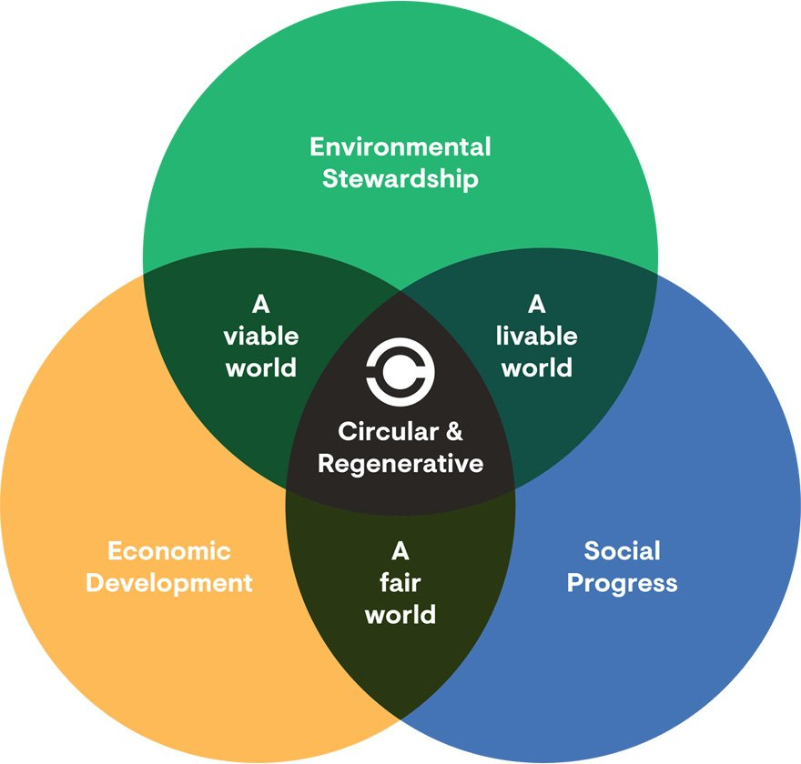

hide:
    - toc
---

# **Making Sense & Meaning**

A film dealing with the relative size of things in the universe and the effect of adding another zero.

<iframe width="560" height="315" src="https://www.youtube.com/embed/0fKBhvDjuy0?start=23" title="YouTube video player" frameborder="0" allow="accelerometer; autoplay; clipboard-write; encrypted-media; gyroscope; picture-in-picture; web-share" allowfullscreen></iframe>

I'd like to share some documentaries that I felt were related to some of the aspects that are discussed in the book - A History of the World in Seven Cheap Things
Book by Jason W. Moore and Raj Patel.

A documentary I recently watched explains the idea of a circular living environment quite well. The Future Food Systems is a project led by Joost Bakker, which aims to demonstrate that we can cultivate and produce food in a more sustainable and waste-free way. Bakker collaborated with FormFlow to construct a building with their unique cladding solution at Federation Square in Melbourne to showcase his vision. The project is highlighted in the Netflix series "Down to Earth with Zac Efron," where viewers can learn more about Bakker's innovative ideas for the future of food production. The ultimate goal of the project is to inspire a new way of thinking about food systems that are not only more sustainable but also more accessible and healthier for everyone.

<iframe width="560" height="315" src="https://www.youtube.com/embed/64Nqy5O0a7I" title="YouTube video player" frameborder="0" allow="accelerometer; autoplay; clipboard-write; encrypted-media; gyroscope; picture-in-picture; web-share" allowfullscreen></iframe>

Seaspiracy" is a documentary film on Netflix that explores the impact of human activity on the world's oceans, highlighting issues such as overfishing, plastic pollution, and the damaging effects of industrial fishing practices. The film exposes some of the darker aspects of the fishing industry and challenges commonly held beliefs about sustainable fishing practices. The documentary has generated controversy but has succeeded in raising awareness about important environmental issues.

<iframe width="560" height="315" src="https://www.youtube.com/embed/1Q5CXN7soQg" title="YouTube video player" frameborder="0" allow="accelerometer; autoplay; clipboard-write; encrypted-media; gyroscope; picture-in-picture; web-share" allowfullscreen></iframe>

My journey through this master has been to look at how to make our conenctions with past practices around material development relevant in today's needs for our society. Using the knowledge that was shared with us but somehow lost along the way, how can I adapt it to generate collaboration, co-creation and circularity through it?

I asked ChatGPT to generate answers for the following statements and questions. I was expecting something very technical and a response that I might be unaware of but I feel we have learnt about these through the various modules during the MDEF course and also have learnt through the kind of interests I have(movies and shows)

Upon questioning what was discussed in the book- A History of the World in Seven Cheap Things: A Guide to Capitalism, Nature, and the Future of he Planet is a book by Raj Patel and Jason W. Moore published in 2018. I got this summary from ChatGPT.

<i>A History of the World in Seven Cheap Things is a book that explores the relationship between capitalism and nature, and how it has shaped the world we live in today. The authors, Raj Patel and Jason W. Moore, argue that capitalism has relied on the exploitation of cheap labor, food, energy, raw materials, and finance to expand and accumulate wealth. These cheap things are made possible by the unpaid work of nature and humans, and by externalizing the social and environmental costs of production and consumption.
The book traces the history of capitalism and its impact on nature and society from the colonial era to the present day, focusing on seven cheap things that have enabled capitalism to thrive: nature, money, work, care, food, energy, and lives. The authors show how these cheap things are interconnected and how they have been used to exploit and dominate people and nature, leading to social and environmental crises such as climate change, inequality, and food insecurity.
The book also offers a critique of mainstream economics and calls for a new approach that recognizes the limits of the planet and the need for ecological and social sustainability. The authors argue that we need to move beyond the logic of cheap things and towards a more just and sustainable economic system that values nature, people, and the common good.</i>

How can design help with what this book talks about?

<i>Design can play an important role in addressing the issues raised in the book "A History of the World in Seven Cheap Things" by Raj Patel and Jason W. Moore. Here are some ways in which design can contribute:
Sustainable Design: Designers can create products, services, and systems that minimize their impact on the environment and reduce the use of cheap natural resources, such as water, energy, and raw materials. Sustainable design can also address the social impacts of production, such as labor conditions, by promoting fair trade and ethical practices.
Human-Centered Design: Designers can place people at the center of the design process, and create products and services that meet their needs and aspirations, rather than imposing solutions from the top down. This approach can address issues of inequality and social injustice by providing equal access and opportunities for all.
Design for Circular Economy: Designers can create products, services, and systems that are designed for reuse, repair, and recycling, rather than for disposal. This approach can reduce waste and the use of cheap materials and promote a more sustainable and efficient use of resources.
Design for Social Change: Designers can use their skills and knowledge to address social issues and promote social change, by designing solutions that improve the quality of life of communities and individuals, and by advocating for policy changes that support social justice and sustainability.
Design for Education: Designers can create educational programs, resources, and experiences that promote awareness and understanding of the issues raised in the book, such as the impact of capitalism on the environment and society, and the need for more sustainable and just economic systems.
In summary, design can contribute to addressing the issues raised in the book by promoting sustainable practices, placing people at the center of the design process, promoting circular economy, advocating for social change, and creating educational resources and experiences.</i>

How can design reconfigure systems of extraction?

<i>Design can play a critical role in reconfiguring systems of extraction by introducing new approaches, methods, and technologies that challenge and transform the current models of extraction. Here are some ways design can contribute to this:

1. Redesigning the Extraction Process: Design can help create more efficient and sustainable methods of extraction that reduce the environmental impact and protect the welfare of workers. This may involve developing new extraction technologies that minimize waste, or rethinking existing methods to improve their efficiency.
2. Promoting Circular Economy: Design can facilitate a circular economy approach, where materials are reused and repurposed to create new products. This approach can help reduce the amount of raw materials required for extraction, and prevent waste from ending up in landfills.
3. Advocating for Ethical and Equitable Practices: Design can help promote ethical and equitable practices in the extraction industry by highlighting the impact of extraction on local communities and advocating for fair compensation for workers. Designers can also work with local communities to develop solutions that meet their needs and priorities.
4. Reducing the Demand for Extractive Industries: Design can help reduce the demand for extractive industries by creating alternative products and services that use renewable resources or are less resource-intensive. For example, designers can create products that are biodegradable or use recycled materials.

Overall, design has the potential to reshape our current systems of extraction by promoting more sustainable, equitable, and ethical practices. By incorporating design thinking into the extraction industry, we can create a more sustainable and equitable future for all.</i>

Knowing all these trends and factors, how do you think we should change to guarantee a sustainable future?

<i>There are many things that individuals and society as a whole can do to promote a sustainable future. Here are some ideas:
Reduce our Carbon Footprint: One of the most significant contributors to climate change is our use of fossil fuels. We can reduce our carbon footprint by using public transportation, biking or walking instead of driving, using energy-efficient appliances, and consuming less energy overall.
Promote Sustainable Agriculture: Agriculture is a major contributor to greenhouse gas emissions and other environmental problems. We can promote sustainable agriculture by supporting local and organic food systems, reducing food waste, and choosing plant-based diets.
Embrace Renewable Energy: Renewable energy sources, such as solar and wind power, are becoming increasingly cost-effective and efficient. We can embrace renewable energy by investing in renewable infrastructure, promoting energy-efficient buildings, and supporting policies that incentivize the use of renewable energy.
Adopt Circular Economy: A circular economy is one in which resources are reused, recycled, or repurposed rather than disposed of. We can adopt circular economy by designing products and systems that are more easily recyclable, promoting reuse and repair, and reducing waste overall.
Support Sustainable Policies: Government policies and regulations can play a significant role in promoting sustainability. We can support sustainable policies by voting for politicians who prioritize sustainability, advocating for policies that promote sustainability, and supporting organizations that work toward sustainability.
Practice Conscious Consumerism: Our consumption patterns can have a significant impact on the environment and society. We can practice conscious consumerism by choosing products that are sustainably produced, supporting companies that prioritize sustainability, and reducing our overall consumption.
Overall, promoting sustainability requires a collective effort from individuals, organizations, and governments. By adopting these practices, we can work toward a more sustainable future for ourselves and future generations.</i>

Which worlds can we design with the power of today's tools?

<i>Today's tools for design are incredibly powerful, providing designers with the ability to create and shape new worlds in ways that were once impossible. Here are some examples of the worlds that we can design with the power of today's tools:

1. Virtual Worlds: With the advent of virtual and augmented reality technologies, designers can create immersive digital worlds that can be experienced in ways that are almost indistinguishable from reality. These worlds can be used for a range of purposes, from entertainment and gaming to education and training.
2. Sustainable Worlds: Designers can leverage their skills and tools to create more sustainable worlds by designing products, buildings, and systems that minimize their impact on the environment. This includes designing products that are made from sustainable materials, buildings that use renewable energy sources, and systems that are designed to be circular and reduce waste.
3. Inclusive Worlds: Designers can design worlds that are more inclusive by creating products, services, and systems that are accessible to people of all abilities and backgrounds. This includes designing products that are easy to use for people with disabilities, creating websites that are accessible to people with visual impairments, and designing public spaces that are welcoming to all.
4. Collaborative Worlds: With the power of digital collaboration tools, designers can work with people from all over the world to create new worlds that are inclusive, sustainable, and innovative. This includes using design thinking methods to co-create solutions with diverse groups of stakeholders, and using collaborative platforms to share knowledge and insights.

Overall, the power of today's design tools allows us to create worlds that are more sustainable, inclusive, and collaborative than ever before. By harnessing these tools, we can work together to shape a better future for ourselves and the planet.</i>

How can we design the transition towards these world?

<i>Designing the transition towards these new worlds requires a multifaceted approach that involves collaboration, experimentation, and iteration. Here are some key steps that can be taken to design a successful transition towards these worlds:

1. Collaborative Design: Designers must work closely with stakeholders from diverse backgrounds to ensure that their needs and perspectives are taken into account in the design process. This includes engaging with communities, industry leaders, and policy-makers to understand their priorities and constraints.
2. Experimentation and Prototyping: Designers must be willing to experiment and prototype new solutions to test their viability and effectiveness. This may involve creating small-scale prototypes or pilot projects to test new ideas in real-world settings.
3. Iterative Design: The design process must be iterative, with designers continuously refining and improving their solutions based on feedback from stakeholders. This may involve conducting user research, testing prototypes with users, and incorporating feedback into subsequent iterations.
4. Holistic Design: Designers must take a holistic approach to designing the transition towards these new worlds, considering the social, economic, and environmental impacts of their solutions. This may involve developing systems-based approaches that take into account the interconnected nature of different aspects of the transition.
5. Capacity Building: Designers must also invest in building the capacity of stakeholders to participate in the design process and implement new solutions. This includes providing training and support to communities, businesses, and policymakers to ensure that they have the knowledge and skills to participate effectively in the transition.

Overall, designing the transition towards these new worlds requires a collaborative, iterative, and holistic approach that takes into account the needs and perspectives of diverse stakeholders. By working together, we can create a more sustainable, inclusive, and innovative future for all.</i>

Why do you think its important for us to design towards these?

<i>Designing towards these new worlds is important for several reasons:

1. Addressing Global Challenges: The world is facing numerous complex challenges, including climate change, social inequality, and technological disruption. Designing towards these new worlds can help address these challenges by creating more sustainable, inclusive, and innovative solutions.
2. Creating a Better Future: By designing towards these new worlds, we can create a better future for ourselves and future generations. This includes creating more livable cities, promoting social equity, and protecting the environment.
3. Unlocking Economic Opportunities: Designing towards these new worlds can also unlock new economic opportunities by creating new industries and jobs, as well as promoting innovation and entrepreneurship.
4. Fostering Collaboration and Innovation: The design process itself fosters collaboration and innovation, bringing together diverse stakeholders to co-create solutions that are more effective, inclusive, and sustainable.
5. Supporting Resilience: Designing towards these new worlds can also promote resilience, helping individuals, communities, and businesses to adapt and thrive in the face of change and uncertainty.

Overall, designing towards these new worlds is important because it helps us address complex challenges, create a better future, unlock economic opportunities, foster collaboration and innovation, and support resilience. By working together to design a more sustainable, inclusive, and innovative future, we can create a better world for ourselves and future generations.</i>

What are the ways to deal with this to document our past better for our future generations knowing that the future might be a mix of dystopian and utopian?

<i>Documenting our past and preserving knowledge for future generations is important to ensure that we don't lose valuable information and can continue to learn and progress as a society. Here are some ways to deal with this challenge:

1. Digital archiving: With the rise of digital technology, it is easier than ever to create digital copies of important documents, images, and other media. Digital archiving can help preserve these materials for future generations, even in the face of natural disasters or other crises. Many institutions, such as libraries and museums, are already digitizing their collections.
2. Oral history: In addition to written records, oral history can be a valuable way to preserve knowledge and experiences. Recording interviews with older generations and other people who have unique perspectives can help ensure that their stories are not lost.
3. Disaster preparedness: While it may not be possible to prevent natural disasters, it is possible to prepare for them. This includes having backup copies of important documents and data stored in multiple locations, as well as having emergency plans in place to protect people and property.
4. Encourage education: Education is key to preserving knowledge and passing it on to future generations. Encouraging people to learn about history, science, and other subjects can help ensure that they have the knowledge and skills needed to build a better future.
5. Collaborative efforts: Collaborating with others, such as researchers, educators, and community members, can help ensure that important knowledge is preserved and shared. This can involve sharing resources and expertise, as well as working together to develop new ways to document and preserve information.

In summary, there are many ways to document our past better for future generations, and it is important to take action now to ensure that valuable knowledge is not lost. By using digital archiving, oral history, disaster preparedness, education, and collaborative efforts, we can work towards a better future.</i>

Projects that I found would relevant to the topics discussed above:

<a class="button" href="https://space10.com/space10-open-sources-the-growroom/">The Growroom</a>

<a class="button" href="https://space10.com/project/tomorrows-meatball/">Tomorrow's Meatball</a>
