---
hide:
    - toc
---

# Digital Prototyping

**Feb 01, 2023**

How to integrate electronics into an idea? Interaction between humans & machines.

Prototype - for proof of concept - Arduino board (Feather esp32)

Schematic designs

**How to select a board?** Depending on what you want to do, the aspects like power, design etc.

- data sheet, pinout, power, how to program, how to setup in Arduino environment and how to install libraries for it.

**Data size** of different computers - K, KB, MB, GB, TB

**Microcontroller** - very small computer, built on a metal oxide board semiconductor circuit chip.

**Featherboards** - produced by Adafruit - is not an Arudiono board in terms of the schematic design of the board.

Arduino releases a lot of core which consists of code that makes it easy peasy for us to use it and control things with it.

<iframe width="560" height="315" src="https://www.youtube.com/embed/V4WtPv0yWek" title="YouTube video player" frameborder="0" allow="accelerometer; autoplay; clipboard-write; encrypted-media; gyroscope; picture-in-picture; web-share" allowfullscreen></iframe>

**The Arduino project** - freedom to use, understand, modify and share your tools. *Open-source information used and modified must be also shared as open-source.*

Copy-left model of copyright license, eg. Blender, Arduino.

**Arduino components** - the hardware, software and community

Open hardware - you can buy a cheap board and use the same design of Arduino but just not use the actual name.

Software - offer us a simple interface to talk between the microcontroller and the board.

Community - big community with basic and expert level of knowledge people to share ideas and questions.

<iframe width="560" height="315" src="https://www.youtube.com/embed/UoBUXOOdLXY" title="YouTube video player" frameborder="0" allow="accelerometer; autoplay; clipboard-write; encrypted-media; gyroscope; picture-in-picture; web-share" allowfullscreen></iframe>


**Things to keep in mind :**

Power -

- what kind of power do you need?
- doe it need to be portable or is it stable?
- How much power?
- Can it be powered differently to reduce consumption within the design or use different sources of energy?
- PoE - Can it use ethernet instead so it get Internet and power at the same time?

Input -

pins, how many do you need, helps you decide which board to use.

does the board have enough of the right kind of pins you need for your project?

Network -

keep it local unless it really needs to communicate with other devices.

How much range do you need? short/ long distance? Cabled or wireless connection?

Data/ Processing capabilities -

What processing speed do you need?

How much RAM, memory do you need?

Flash size - how big can your code be which you flash into the board.

What kind of data does it need to process? use SBC for audio/video at high speed/resolution.

Data storage - do you need to store it on the board? need memory? use a board with SD card compatibility.

Usability

size - to fit into your project context

power - how much power is required to use it

user interface - how easy or difficult is it to use it

documentation - does it have all the right documentation of how to use it properly?

tutorial availability - same as ^

programming interface-

you have to check if your board is supported by arduino.

Go for C language if you've never coded before.

Python demands a lot more storage and doesn’t offer that much control.

Debugging - of course check your code but quite often its your cables that are mismatched, loose or not enough voltage( if power is not okay, your device won’t work).

Power or heat

power - your device should be powered properly, should have enough power or you’ll get a bad reading.

heating - if your chip is overheating, it will do crazy things that you won’t be able to understand.

serial.print- as much information as you can send to yourself of your device, you should.

Functions learned on DAY 01

*buzzer / piezo speakertone(), noTone() functions*

# Reflection

Found it frustrating as I wanted to try out a particular tune but most of the examples online were for the Arduino Uno board, I guess it's because this board is an older board. The feather esp32 microcontroller has more capabilities. So then I decided to try and find a very basic code which I then tried to understand. The circuit was fairly simple to set up and for the code I had to define which pin I would be using on the microcontroller to control the buzzer. After that you just have to

**Feb 02, 2023**

CAM

- When you transform a design to a language that the manufacturing machines can understand.
- Rhino is Cad
- Cura is a CAM
- Fusion is an all in one tool, CAD, CAM, generative design and beam.

CPU vs GPU

CPU does big mathematical equations, complex ones, but one by one.

GPU is dumb but it has the ability to calculate small operation, large number of them all at the same time.

Vector (x2 x y2 = R)

no texture

Pixel

pixels are the smallest unit of bitmap images, which are also called raster images or bitmap.

An image with more pixels multiplied by more pixels will be a much larger and sharper image as well. We have the flexibility of using a large pixel image on a larger surface as well as reducing the size, it will remain sharp. Wheres, a lower pixel images cannot be used on a larger surface area, its quality & sharpness will deteriorate considerably.

sRGB

Resolution

More pixels needs more compressor speed so your device then won’t last for so long because you'll have to keep giving your device energy.

JPEG file loosing pixels - find readings about it, compresses and de-compresses every time you open the file.

PNG - best file sharing format, doesn’t need any compressor.

TIFF - multi-layer file format, compressionless, transparent format.

x | y | z POINTS - define position of 3d modelling.

Mesh / Nurbs - U & V surface space

Nurbs - Non-uniform rational B-splines

you can connect several of these and create a surface.

Easy to modify, smooth surface.

You need a powerful CPU

Mesh - collection of vertices, edges and faces.

You need a good GPU

Triangular, Quadrilateral, Hexagonal mesh types

3D scanner is always a mesh file format because it look for these mesh point.

You can sketch a model in NURBS and when you need to manufacture it then you translate it to a MESH format.

MAP A texture

.obj file format for a texture.

3D sculpting

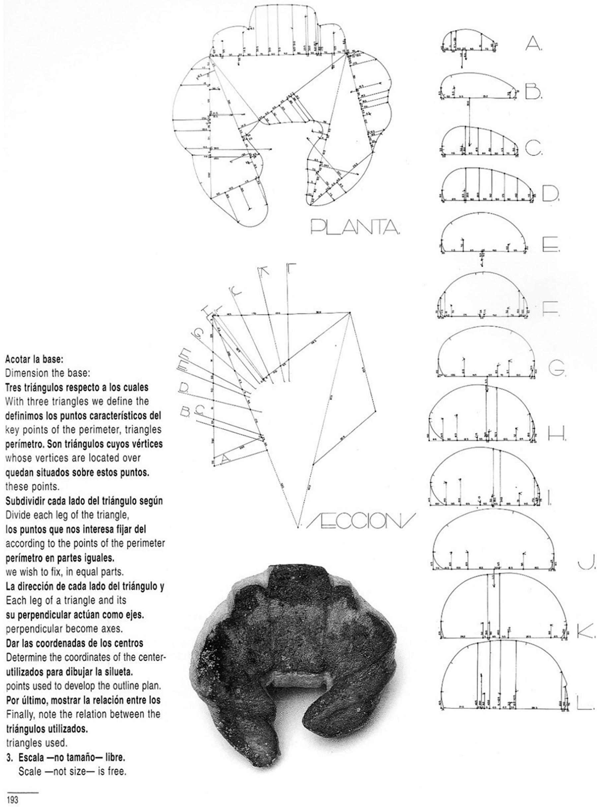

**Parametric design** is a process based on algorithmic thinking that allows the expression of parameters and rules that together define, codify and clarify the relationship between design intent and design response.

# Reflection

We were introduced to all basic concepts and then insights into different softwares for 2D modeling, 3D modeling and Parametric modeling.

I found a tutorial on Youtube for parametric design, I tried following a video for the Metropol Parasol. After a while I noticed I had made a mistake half way in one of them.

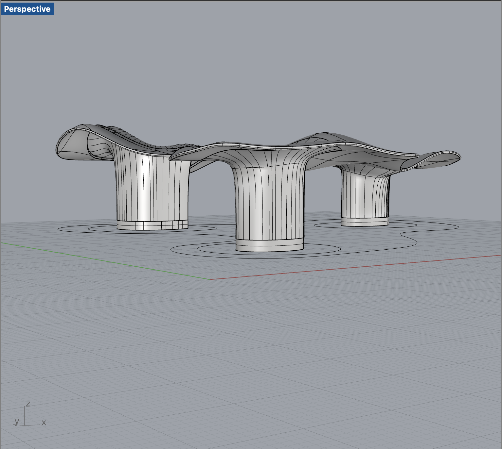

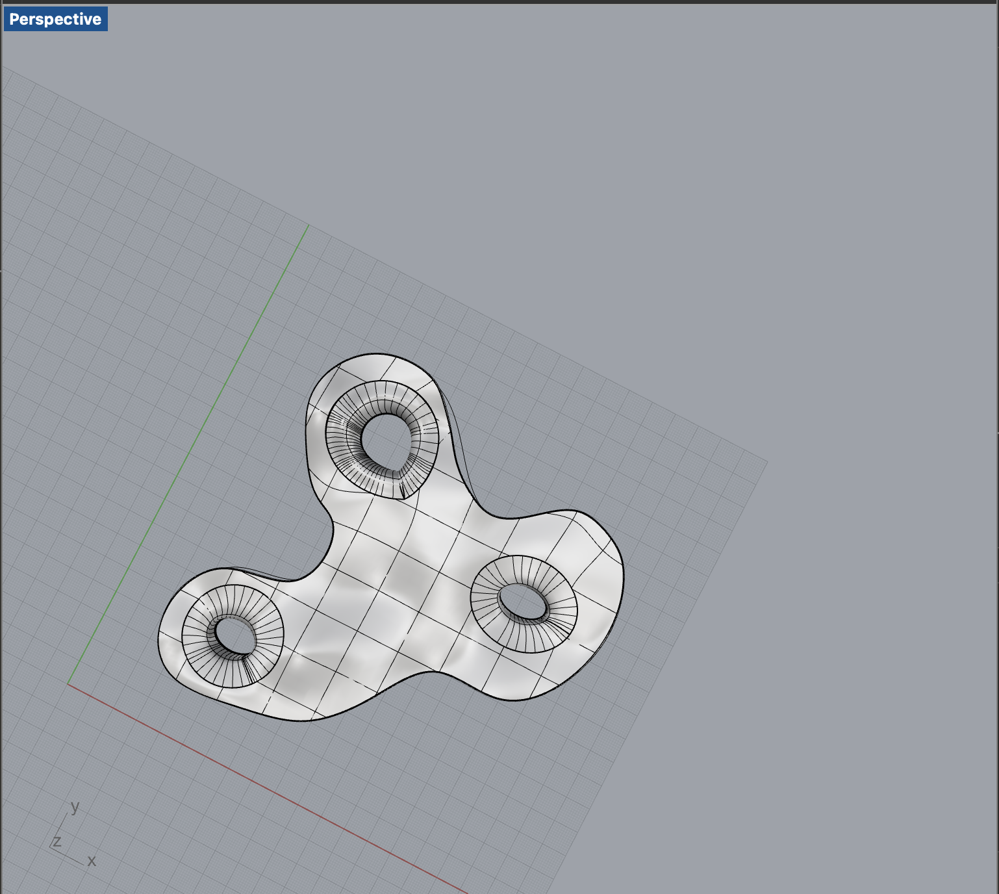

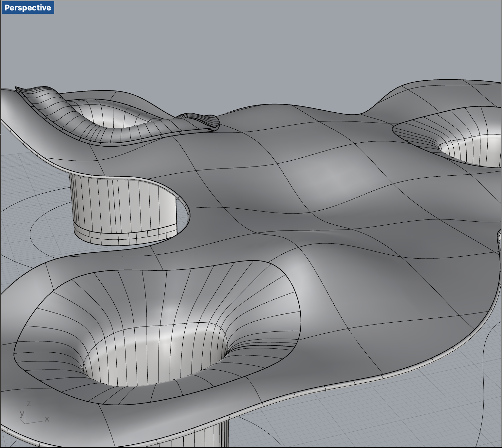

Coding modelling ^

Idea - Login - Design

x,y,z,r,h - Five variables you define and can change for parametric modelling.


Array - x spacing and y spacing

array of 5 lines with specific dimension

at each array you place a cube with x,y dimension.

Topological Optimisation - mathematical method that optimises material layout within a given design space, for a given set of loads, boundary conditions and constraints with the goal of maximising the performance of the system.

FEM (*finite element modeling)*

- FEM is an approximation method that subdivides a complex problem space, or *domain*
, into numerous small, simpler pieces (the finite elements) whose behavior can be described with comparatively simple equations.
- FEM was originally developed for engineering analysis to model and analyze complex systems in mechanical, civil, and aeronautical engineering. It has as its foundation the basic concepts of mechanics, such as Newton’s laws of motion, conservation of mass and energy, equilibrium, and the laws of thermodynamics.

[An Introduction to Finite Element Modeling](https://blog.spatial.com/finite-element-modeling)

Material Reduction

Shortened Design Process

Maximum Performance

swarm algorithm

ant topological behaviour - Marco Dario

forces always go to the shortest path.

eg. Tokyo subway system

G code - we write in G code for the machine | M code - for the actions

Robotic arm - x,y,z,a,b,c (6-axis)

LASER Light Application by Stimulated Emission of Radiation - focused photons at a series of frequency through optics.

Red - infrared - fast frequency

Radio waves - can kill us

Ultraviolet - if we lose the ozone layer then the sun will send more UV rays.

X-rays - can penetrate through us

Gamma rays - nuclear energy produces a lot of these.

Laser cutting - low density materials - plastics, wood, cardboard, fabrics, etc.

Parts of layer cutter

Laser source | options | 3(+) axis CNC | controller

Micro controller vs. micro processor (READ)

Micro-controller don’t stop working unless there’s an issue with your code.

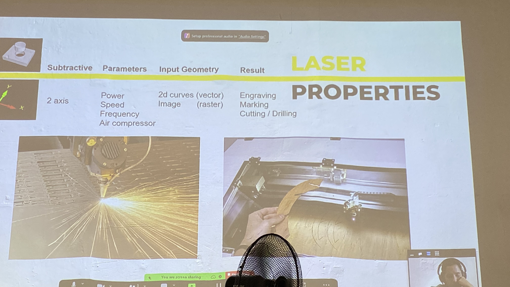

nesting tool - deep nest, rhino nest, svgnest

tolerance

kerf - the width of the material you are losing while cutting

Slicer Fusion - stacking, waffle, paper folding

[Slicer for Fusion 360](https://www.google.com/url?sa=t&rct=j&q=&esrc=s&source=web&cd=&cad=rja&uact=8&ved=2ahUKEwjAx4Xc3IX9AhUGHOwKHd50D5cQFnoECBwQAQ&url=https%3A%2F%2Fknowledge.autodesk.com%2Fsupport%2Ffusion-360%2Ftroubleshooting%2Fcaas%2Fdownloads%2Fcontent%2Fslicer-for-fusion-360.html&usg=AOvVaw1KMAnoIXbIJM6h0VKvtOj2)

# Refelection

I decided to design a box for storing biomaterials and it has been said that every MDEF student makes a box at some point. I wanted to use acrylic so when you store the materials, you can see all the waste in it, it can look visually pleasing. I decided to engrave the letters futura on it, to signify the materials we will use more in the future.


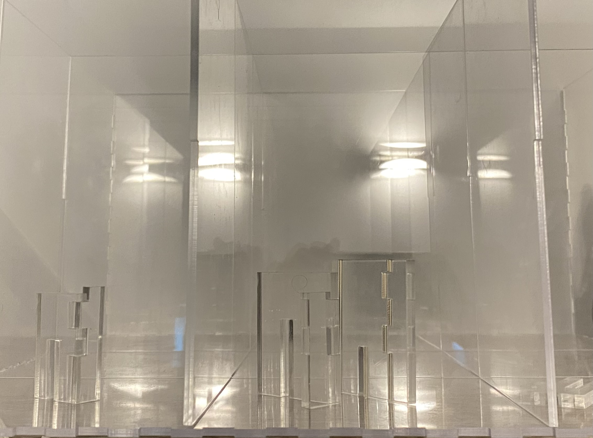

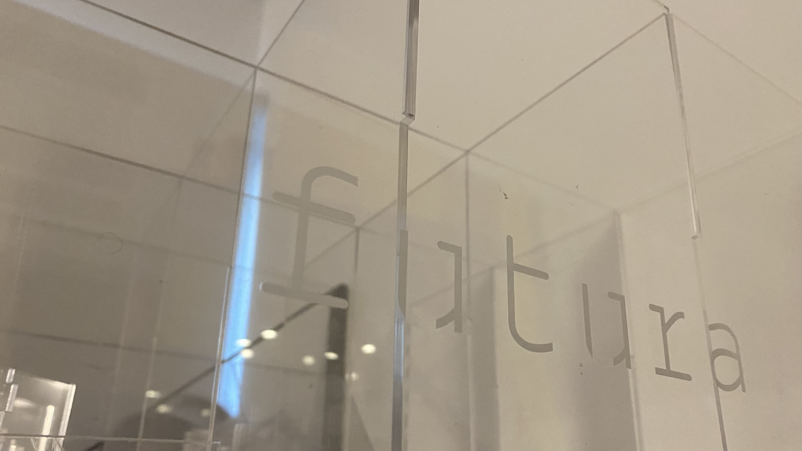


**vinyl cutter**

inside to outside cutting

force the machine to do it by drawing in those colours to order the cutting process.

vector vs. rastor

rastor will remove that whole part (hatch pattern)

vector will just be a line cut

all machine work in mm dimensions.

vinyl cutter - you can cut really long designs

control over - speed, temperature, power, force and how long the blade is.

thicker material will need a longer blade

[Silhouette America](https://www.silhouetteamerica.com/software)

HOMEWORK : make a press fit design

1. how to interlock pieces together
2. make some moulds - cutting stacking layers to make the mould.

save on rhino 5 file for the machines

subtracting (laser-cut) / additive (3D printing)

save lots of material

more complex designs

downsides -

all printed objects have weak axis in the joining axis

needs to be strengthened with supports in-between

Isotropic - similar structure properties in all directions

plastic extrusion (FDM)

SLA (light polymerised) - resins, have some additive which get photons at a specific duration and start a chemical reaction. By heat, light or different compounds.

powder bed (3DP) - metal/ceramic/other powder which can bound by a binder. Can be bound by heat, inks, or lasers.

thermo plastics get in a fluid state when heated, you can undo it.

3D model - slicer software - 3D printer (material and printer capabalities)

FDM

bed

print head / extrusion head

supports

Layer Height

005 or 02

when you print thinne, you can increase the speed.

when you print thick, you should print slower.

By creating complex geometry within the object, you can save more material and time.

SHELL - top layer, bottom layer, shell and infill

INFILL - to fill density, 50% infill is stronger. Most printer’s use 20% infill.

more infill + additional thickness of the casing provides strength (can be driller)

Types of Infill-

rectangular / triangular / wiggle / honeycomb

You can change the shape properties using different infill patterns. Eg. a wiggle infill pattern can be springy/ flexible.

STL - mesh file for 3D printing

OBJ is the best - has scale also.

Paste printing - the consistency can be worked on by additives to make them cure faster and also reduce the material properties.

Non-planar printing - curved layers

multi axis cdm-fff printing

SLS - structured light scanners

Pattern + light to calculate deformities to scan the object.

<iframe width="560" height="315" src="https://www.youtube.com/embed/VaXrX0veR9Y" title="YouTube video player" frameborder="0" allow="accelerometer; autoplay; clipboard-write; encrypted-media; gyroscope; picture-in-picture; web-share" allowfullscreen></iframe>

<iframe width="560" height="315" src="https://www.youtube.com/embed/s-lvK3uwkqw" title="YouTube video player" frameborder="0" allow="accelerometer; autoplay; clipboard-write; encrypted-media; gyroscope; picture-in-picture; web-share" allowfullscreen></iframe>

<iframe width="560" height="315" src="https://www.youtube.com/embed/axdPIc6FqQU" title="YouTube video player" frameborder="0" allow="accelerometer; autoplay; clipboard-write; encrypted-media; gyroscope; picture-in-picture; web-share" allowfullscreen></iframe>

<iframe width="560" height="315" src="https://www.youtube.com/embed/yJhWasl8QYw" title="YouTube video player" frameborder="0" allow="accelerometer; autoplay; clipboard-write; encrypted-media; gyroscope; picture-in-picture; web-share" allowfullscreen></iframe>

Etymology

photogrammetry

<iframe width="560" height="315" src="https://www.youtube.com/embed/ZIW4XU6Wm8Q" title="YouTube video player" frameborder="0" allow="accelerometer; autoplay; clipboard-write; encrypted-media; gyroscope; picture-in-picture; web-share" allowfullscreen></iframe>

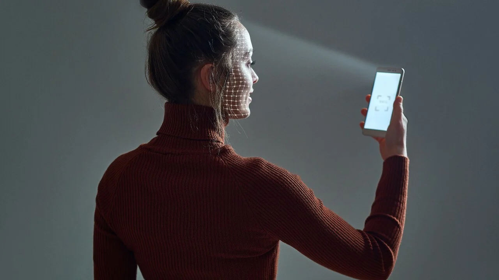

dome take

cylindrical take

orbital

E57 - landscape but is rhino compatible

scanning a house, the house is geolocalised. you can put it into google maps and your house will be there in super high resolution scanned.

Autodesk Recap Photo

Meshroom/Alicevision

Regard3D

Colmap

Visual SFM

UPLOAD THE FILES ON SKETCHFAB

You don’t upload images with the sky as the blue takes a lot of computing power for the 3d scan, so upload png without the sky.

**Networking & Communication**

communication - free flowing data/ electricity/ energy from one point to another

**internet** - read the sensor to send data by reading the values and sending it to the network.

**network** - a set of devices connected to each other through any type of communication lines that allows the exchange of data between them.

why do we want networks?

- to give information to someone who is not in the same place.

**Communication protocols** - The protocol defines the rules, syntax, semantics and synchronization of communication and possible error recovery methods.

air / ears / mouth are the physical parts that let the data flow.

but when you speak in another language, the data doesn’t flow cause you don’t understand. So you need a set of rules/ protocols to define how data is going to flow.

Depending on the different networks, there are different protocols.

**Gateway** - star network topology

**DNS** - Domain Name System - the part before .com / .edu / .org

**Gemini** is a new internet protocol that aims to be simple, fast, and efficient. It was created as an alternative to HTTP and HTTPS, which are more complex and slow due to their many features and security measures. Gemini is designed to be easy to implement and use for both clients and servers. It uses a simple text-based format for requests and responses, and supports basic HTML-like formatting for text content.

**Asynchronised communication** - serial.begin function

there is no timing constraint.

**Synchronised communication** - eg; a beating drum for synchronised rowing of a boat.

there is a time constraint.

There are two ports connected - Data line and a time constraint.

OTA - over the air communication

rainbow is high frequency of light

pitch is a high frequency audio

amplitude modulation - AM

frequency modulation - FM

<a href="http://radio.garden/visit/vilassar-de-mar/0LpQRpJj">Radio Garden</a>

#Reflection

We had an incredibly insightful session focused on electronics and sensors. We deepened our understanding of essential concepts like pull-up and pull-down resistors, as well as inputs and outputs in electronic circuits.

For today's assignment, we were tasked with utilizing a Light Dependent Resistor (LDR) and Actuating Light to test Morse code. This practical exercise allowed us to apply our knowledge and explore the transmission of information using light signals.

<div style="position: relative; width: 100%; height: 0; padding-top: 100.0000%;
 padding-bottom: 0; box-shadow: 0 2px 8px 0 rgba(63,69,81,0.16); margin-top: 1.6em; margin-bottom: 0.9em; overflow: hidden;
 border-radius: 8px; will-change: transform;">
  <iframe loading="lazy" style="position: absolute; width: 100%; height: 100%; top: 0; left: 0; border: none; padding: 0;margin: 0;"
    src="https:&#x2F;&#x2F;www.canva.com&#x2F;design&#x2F;DAFl5qstj5k&#x2F;watch?embed" allowfullscreen="allowfullscreen" allow="fullscreen">
  </iframe>
</div>
<a href="https:&#x2F;&#x2F;www.canva.com&#x2F;design&#x2F;DAFl5qstj5k&#x2F;watch?utm_content=DAFl5qstj5k&amp;utm_campaign=designshare&amp;utm_medium=embeds&amp;utm_source=link" target="_blank" rel="noopener">LDR Sensor</a>

### 01 March 2023

int LED_PIN = 14 vs. #define LED_PIN = 14

#define is more convenient and efficient

serial monitor message = blink

*it blink 3 times

Install JLED code on Arduino

code 01

```jsx
#include "jled.h"
#define LED_PIN 14

// New code for MQTT!
//-------------------
#include <WiFi.h>
#include <PubSubClient.h>

const char* ssid = "Iaac-Wifi";
const char* password = "EnterIacc22@";
WiFiClient wifiClient;

const char* mqttBroker = "mqtt-staging.smartcitizen.me";
const char* mqttClientName = "team";
const char* mqttClientUser = "fablabbcn102";
const char* mqttClientPass = "";
const char* topicToSub = "lab";
// const char* topicToPub = "lab";
PubSubClient mqttClient(wifiClient);
//-------------------

// Jled object.
// More information here: https://github.com/jandelgado/jled#usage
JLed led = JLed(LED_PIN);

//-------------------
// Add more animations here!
// Basic blink
void blink () {
  led.Blink(1000, 600).Repeat(3);
}

// Smooth breathing
void breathe() {
  led.Breathe(1000).Repeat(3);
}
//-------------------

void mqttConnect() {

  while (!mqttClient.connected()) {

    Serial.print("Attempting MQTT connection...");

    if (mqttClient.connect(mqttClientName, mqttClientUser, mqttClientPass)) {

      Serial.println("connected");
      mqttClient.publish("hello", mqttClientName);

      // Topic(s) subscription
      mqttClient.subscribe(topicToSub);

    } else {

      Serial.print("failed, rc=");
      Serial.print(mqttClient.state());
      Serial.println(" try again in 5 seconds");
      delay(5000);

    }
  }
}

void callback(char* topic, byte* message, unsigned int length) {

  String newMsg;

  for (int i = 0; i < length; i++) {
    newMsg += (char)message[i];
  }

  Serial.print("Message arrived on topic: ");
  Serial.print(topic);
  Serial.print(". Message: ");
  Serial.println(newMsg);

  if (String(topic) == topicToSub) {

    // For debugging purposes, print it
    Serial.print("Got new message!: ");
    Serial.println(newMsg);

    // Blink if we tell it to!
    if (newMsg.equals("blink")){
      blink();
    // Or breathe!
    } else if (newMsg.equals("breathe")) {
      breathe();
    }
  }
}

// the setup function runs once when you press reset or power the board
void setup() {
  // initialize digital pin LED_BUILTIN as an output.
  Serial.begin(9600);

  // Connect to wifi
  WiFi.begin(ssid, password);

  while (WiFi.status() != WL_CONNECTED) {
    delay(500);
    Serial.print(".");
  }

  Serial.print("Connected to ");
  Serial.println(ssid);
  Serial.print("IP address: ");
  Serial.println(WiFi.localIP());

  // MQTT setup
  mqttClient.setServer(mqttBroker, 1883);
  mqttClient.setCallback(callback);

}

// the loop function runs over and over again forever
void loop() {

  // Check if we are still connected to the MQTT broker
  if (!mqttClient.connected()) {
    mqttConnect();
  }  

  // Let PubSubClient library do his magic
  mqttClient.loop();

  // Do not remove this line!
  led.Update();
}
```

code 02

```html
int LED_PIN = 14

void setup() {
  // initialize digital pin LED_BUILTIN as an output.
  pinMode(LED_pin, 14);
}

// the loop function runs over and over again forever
void loop() {
  digitalWrite(LED_PIN, HIGH);  // turn the LED on (HIGH is the voltage level)
  delay(1000);                      // wait for a second
  digitalWrite(LED_PIN, LOW);   // turn the LED off by making the voltage LOW
  delay(1000);                      // wait for a second
}
```

code 03

```html
// the setup function runs once when you press reset or power the board
void setup() {
  // initialize digital pin 14 as an output.
  pinMode(14, OUTPUT);
}

// the loop function runs over and over again forever
void loop() {
  digitalWrite(14, HIGH); // turn the LED on
  delay(500);             // wait for 500 milliseconds
  digitalWrite(14, LOW);  // turn the LED off
  delay(500);             // wait for 500 milliseconds
}
```

code 04

```html
#include "Arduino.h"
#include "JLED.h"
#define LED_PIN 14

// Jled object.
// More information here: https://github.com/jandelgado/jled#usage
auto led = JLed(LED_PIN);

// the setup function runs once when you press reset or power the board
void setup() {
  // initialize digital pin LED_BUILTIN as an output
  Serial.begin(9600);
}

// Basic blink
void blink () {
  led.Blink(1000, 600).Repeat(3);
}

// Smooth breathing
void breathe() {
  led.Breathe(1000).Repeat(3);
}

// the loop function runs over and over again forever
void loop() {

  if (Serial.available()) {
    // Read the string and clean it up
    String newMsg = Serial.readString();
    newMsg.trim();

    // For debugging purposes, print it
    Serial.print("Got new message!: ");
    Serial.println(newMsg);

    // Blink if we tell it to!
    if (newMsg.equals("blink")){
      blink();
    // Or breathe!
    } else if (newMsg.equals("breathe")) {
      breathe();
    }
  }

  // Do not remove this line!
  led.Update();
}
```

code 05

```html
#include "Arduino.h"
#include "jled.h"
#define LED_PIN 14

// New code for MQTT!
//-------------------
#include <WiFi.h>
#include <PubSubClient.h>

const char* ssid = "Iaac-Wifi";
const char* password = "EnterIaac22@";
WiFiClient wifiClient;

const char* mqttBroker = "mqtt-staging.smartcitizen.me";
const char* mqttClientName = "team";
const char* mqttClientUser = "fablabbcn102";
const char* mqttClientPass = "";
const char* topicToSub = "lab";
// const char* topicToPub = "lab";
PubSubClient mqttClient(wifiClient);
//-------------------

// Jled object.
// More information here: https://github.com/jandelgado/jled#usage
JLed led = JLed(LED_PIN);

//-------------------
// Add more animations here!
// Basic blink
void blink (int time_on = 100) {
  led.Blink(time_on, time_on).Repeat(3);
}

// Smooth breathing
void breathe(int time_on = 100) {
  led.Breathe(time_on).Repeat(3);
}
//-------------------

void mqttConnect() {

  while (!mqttClient.connected()) {

    Serial.print("Attempting MQTT connection...");

    if (mqttClient.connect(mqttClientName, mqttClientUser, mqttClientPass)) {

      Serial.println("connected");
      mqttClient.publish("hello", mqttClientName);

      // Topic(s) subscription
      mqttClient.subscribe(topicToSub);

    } else {

      Serial.print("failed, rc=");
      Serial.print(mqttClient.state());
      Serial.println(" try again in 5 seconds");
      delay(5000);

    }
  }
}

void callback(char* topic, byte* message, unsigned int length) {

  String newMsg;

  for (int i = 0; i < length; i++) {
    newMsg += (char)message[i];
  }

  // Serial.print("Message arrived on topic: ");
  // Serial.print(topic);
  // Serial.print(". Message: ");
  // Serial.println(newMsg);

  if (String(topic) == topicToSub) {

    // For debugging purposes, print it
    // Serial.print("Got new message!: ");
    // Serial.println(newMsg);

    int pos = newMsg.indexOf("/");
    String action;
    int param;
    if (pos > -1) {
      action = newMsg.substring(0, pos);
      param = newMsg.substring(pos+1).toInt();
    } else {
      action = newMsg;
      param = 100;
    }

    // Serial.print("Action requested: ");
    // Serial.println(action);    

    // Serial.print("Parameter: ");
    // Serial.println(param);

    // Blink if we tell it to!
    if (action.equals("blink")){
      blink(param);
    // Or breathe!
    } else if (action.equals("breathe")) {
      breathe(param);
    }
  }
}

// the setup function runs once when you press reset or power the board
void setup() {
  // initialize digital pin LED_BUILTIN as an output.
  Serial.begin(9600);

  // Connect to wifi
  WiFi.begin(ssid, password);

  while (WiFi.status() != WL_CONNECTED) {
    delay(500);
    Serial.print(".");
  }

  Serial.print("Connected to ");
  Serial.println(ssid);
  Serial.print("IP address: ");
  Serial.println(WiFi.localIP());

  // MQTT setup
  mqttClient.setServer(mqttBroker, 1883);
  mqttClient.setCallback(callback);

}

// the loop function runs over and over again forever
void loop() {

  // Check if we are still connected to the MQTT broker
  if (!mqttClient.connected()) {
    mqttConnect();
  }  

  // Let PubSubClient library do his magic
  mqttClient.loop();

  // Do not remove this line!
  led.Update();
}
```

### 02 March 23

CNC Milling

-subtractive technique, removing material from a solid block

-rotational blades

-most industrialised procedures, most industries use these machines, because it’s completely automated

-very strong because isotropic material is started with

-very intricate designs can be achieved because of 3 axis.

-2d, 3d and 2.5d cuts

-2.5d cuts is how much you control in height. so engrave but not cut through the entire way.

<iframe width="560" height="315" src="https://www.youtube.com/embed/8INjmc-WWSY?start=60" title="YouTube video player" frameborder="0" allow="accelerometer; autoplay; clipboard-write; encrypted-media; gyroscope; picture-in-picture; web-share" allowfullscreen></iframe>

# Reflection

The assignment was to create a file for CNC and get it developed, and for this assignment, I did not require it for my master project or for the microchallenge for Andaaza. .I did not want to utilise this machinery just for the sake of the assignment, so I did not use this individually but learnt how to create a file for the CNC machine with Caglar as he was building a side table with a pattern as a engraving and using cuts all the way to cut out the desired shape of the table.

AUTOMATION

ACCURATE

- kerf
- cutting style - the laser goes on the line, it cuts a half on one side and half on the other so the dimension of the object will change. But if you choose the option ‘cut outside of the line’ then you get the interior part of the dimension.
- tolerance
- dog bone / T-bone cuts so the pieces fit together really well.

TOOLPATH

which order, what speed to cut which part in

6mm end mill will cut max. 3mm

fabricate in pairs or more

make a pice of furniture for the class

or something for your intervention’

add 0.4mm + thickness of material for the cut depth to be sure the material is cutting cut all the way through.


 <h3>3D Printing</h3

 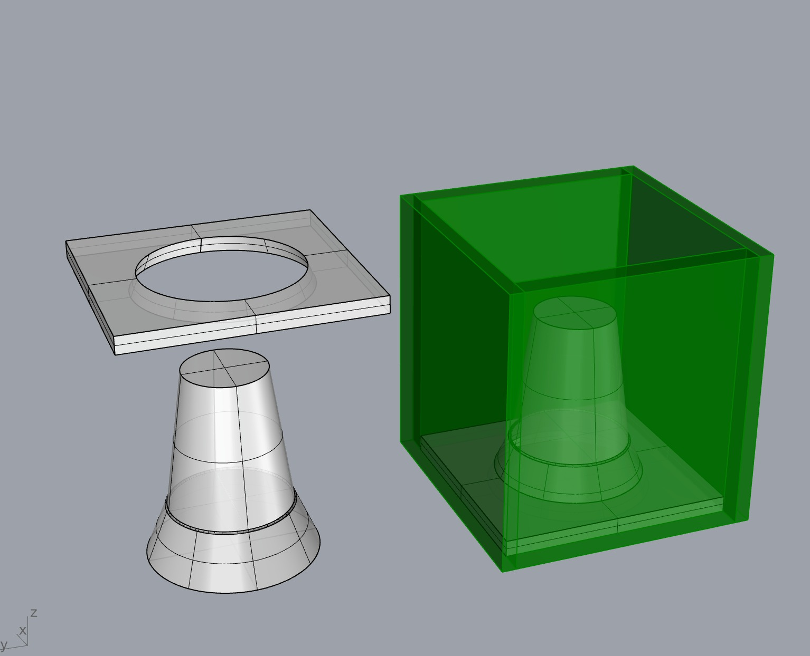

 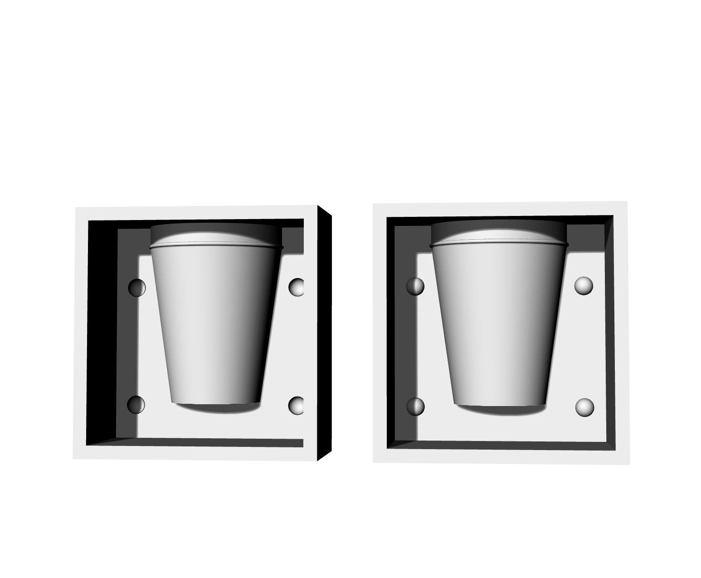

 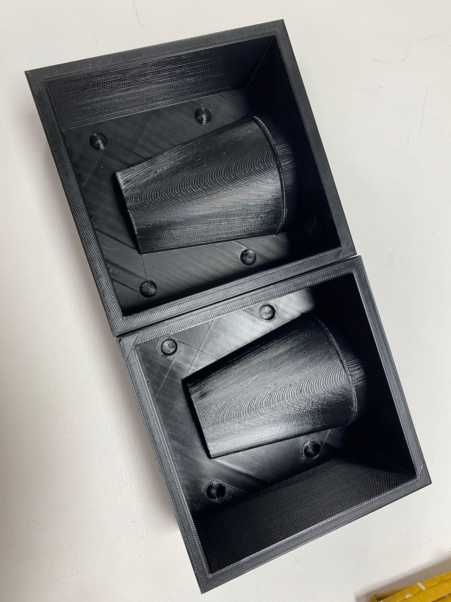

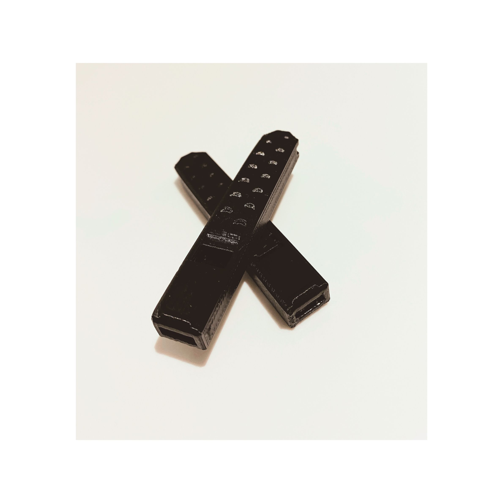

# Reflection on 3D Printing

I tried to 3d print a whistle but did not understand the file properly so my first print was a disaster. I had printed a whistle but without the cavity inside so it would not work. I corrected the file and removed all supports this time and it works really well. I would have liked to use the compostable material to print it or even the transparent filament but since the black colored was already connected to the Ender 3d printer, i went ahead with it.


<p id="a5b93410-07d2-4e79-8c05-1349ff6c2f12" class=""><mark class="highlight-blue_background">Reflection on Microchallenge</mark></p><p id="d491c89e-adbd-4466-8a55-84ca084a50f6" class=""><mark class="highlight-blue_background"><p id="2e7c7a9b-dfcf-4025-b5e1-9185a7c82eff" class="">I had already planned to continue to work on the same artefact from challenge 01. We worked together on improving the pen holder with a new gasket/washer so it would grip the tool better. We wanted to prevent it from moving upwards and downwards while rotating but wanted it to make sideways to carve more smoothly and precisely. Making the moulds for the cups was really fun. It was the first time I had made something like this. We had a few challenges with removing our plaster from the 3d printed mould has we had some sharp corners. It would have been better to make a 3-part mould instead of what we made. In the end, we ended up destroying the 3d printed mould which was a shame but it had to be done. Overall, we made a lot of progress during this week. We improved the coding so the spinning table movement could be customised and controlled with a knob, we could also alternate the direction of it. We still need to work on preventing the pause of the carving tool while the table spins..We will do this during the next round. Our design of the artefact has developed considerably, it is now a perfect conbination of a phonograph and spinning table with a carving tool! </p><p id="77c45388-4d9c-4c29-bbbe-14599caef51d" class="">


# Reflection Microchallenge 02

We used the FabLab a lot during this challenge. We used the laser cutter to cut out the gramophone for the artefact, we improved the carving tool holder for better precision. We also printed another mould for the cups but had to damage it to get the plaster mould out. We made a lot of improvements to the artefact and spent time to fixing the controllers to move separate while using audio as the controller. We made more cups using the slip-cast technique and painted them to achieve a look so you can see the pattern that gets carved on the turn table.

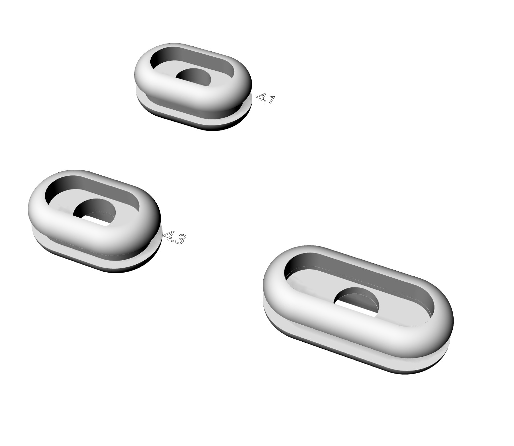

<a href="https://github.com/SeherKrishna02/Andaaza.git">Andaaza Github Page</a>
