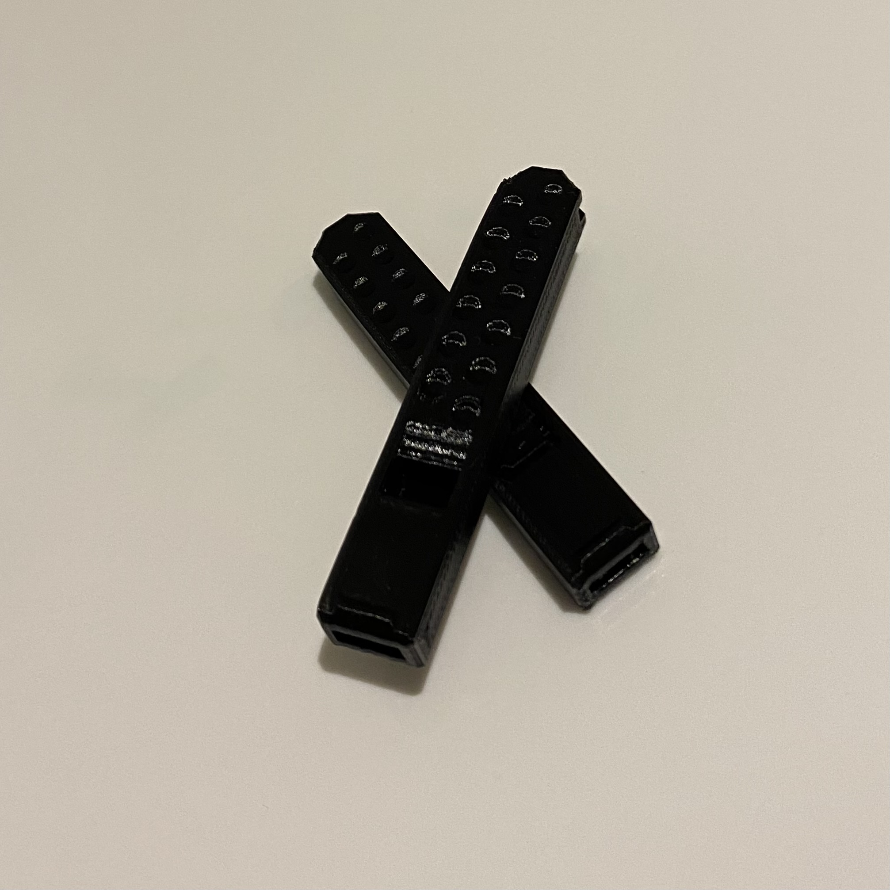
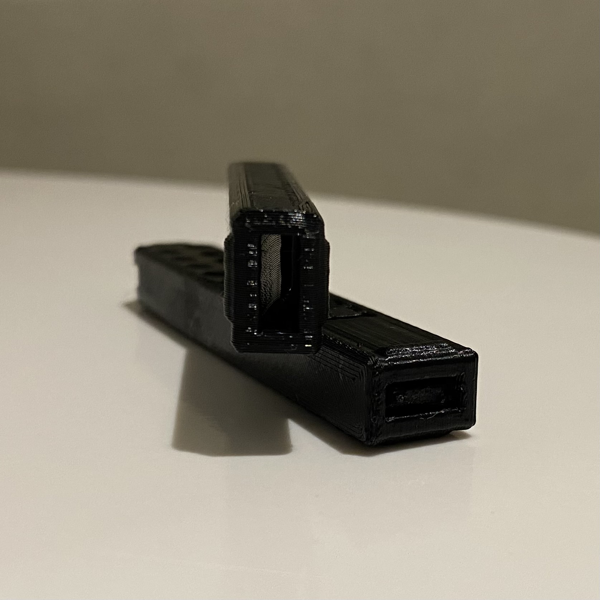

<html><head><meta http-equiv="Content-Type" content="text/html; charset=utf-8"/><title>Digital Prototyping</title></head><body><article id="6fce6123-dd67-4cbc-a860-08ca395eda1a" class="page mono"><header><h1 class="page-title">Digital Prototyping</h1></header>

<strong><mark class="highlight-red">Feb 01, 2023</mark></strong>

How to integrate electronics into an idea? Interaction between humans &amp; machines.

Prototype - for proof of concept - Arduino board (Feather esp32)

<mark class="highlight-gray_background">Schematic designs</mark>

<strong>How to select a board?</strong> Depending on what you want to do, the aspects like power, design etc.

- data sheet, pinout, power, how to program, how to setup in Arduino environment and how to install libraries for it.

<strong>Data size</strong> of different computers - K, KB, MB, GB, TB

<strong>Microcontroller</strong> - very small computer, built on a metal oxide board semiconductor circuit chip.

<strong>Featherboards</strong> - produced by Adafruit - is not an Arudiono board in terms of the schematic design of the board.

Arduino releases a lot of core which consists of code that makes it easy peasy for us to use it and control things with it.
<figure id="23524b74-a0bc-4fdd-a585-572dfe639055">
<a href="https://www.google.com/url?sa=t&amp;rct=j&amp;q=&amp;esrc=s&amp;source=web&amp;cd=&amp;cad=rja&amp;uact=8&amp;ved=2ahUKEwjYkcPciPT8AhViVeUKHWxUCnoQtwJ6BAhMEAI&amp;url=https%3A%2F%2Fwww.youtube.com%2Fwatch%3Fv%3DV4WtPv0yWek&amp;usg=AOvVaw2jlEQQCJfUQF9PDQzRmKvk">https://www.google.com/url?sa=t&amp;rct=j&amp;q=&amp;esrc=s&amp;source=web&amp;cd=&amp;cad=rja&amp;uact=8&amp;ved=2ahUKEwjYkcPciPT8AhViVeUKHWxUCnoQtwJ6BAhMEAI&amp;url=https%3A%2F%2Fwww.youtube.com%2Fwatch%3Fv%3DV4WtPv0yWek&amp;usg=AOvVaw2jlEQQCJfUQF9PDQzRmKvk</a>
</figure>

<strong>The Arduino project</strong> - freedom to use, understand, modify and share your tools. <em>Open-source information used and modified must be also shared as open-source.</em>

Copy-left model of copyright license, eg. Blender, Arduino.

<strong>Arduino components </strong>- the hardware, software and community

Open hardware - you can buy a cheap board and use the same design of Arduino but just not use the actual name.

Software - offer us a simple interface to talk between the microcontroller and the board.

Community - big community with basic and expert level of knowledge people to share ideas and questions.
<figure id="e78684d4-f1c4-4df7-82d6-5f33dab19fa0">
<a href="https://www.youtube.com/watch?v=UoBUXOOdLXY">https://www.youtube.com/watch?v=UoBUXOOdLXY</a>
</figure>

<strong>Things to keep in mind :</strong>

Power -
<ul id="7b91d312-d3c5-481e-81d0-219592bbda69" class="bulleted-list"><li style="list-style-type:disc">what kind of power do you need?</li></ul><ul id="00f40142-8cbd-430c-a138-2423a84cf2d8" class="bulleted-list"><li style="list-style-type:disc">doe it need to be portable or is it stable?</li></ul><ul id="bf4c4106-7c4f-4486-bf69-b8e67c0f5540" class="bulleted-list"><li style="list-style-type:disc">How much power?</li></ul><ul id="fde3d69f-2cdf-4370-91e3-04781991b65f" class="bulleted-list"><li style="list-style-type:disc">Can it be powered differently to reduce consumption within the design or use different sources of energy?</li></ul><ul id="fb1a03b3-896f-4f16-a2a0-de718f486fa6" class="bulleted-list"><li style="list-style-type:disc">PoE - Can it use ethernet instead so it get Internet and power at the same time?</li></ul>

Input -

pins, how many do you need, helps you decide which board to use.

does the board have enough of the right kind of pins you need for your project?

Network -

keep it local unless it really needs to communicate with other devices.

How much range do you need? short/ long distance? Cabled or wireless connection?

Data/ Processing capabilities -

What processing speed do you need?

How much RAM, memory do you need?

Flash size - how big can your code be which you flash into the board.

What kind of data does it need to process? use SBC for audio/video at high speed/resolution.

Data storage - do you need to store it on the board? need memory? use a board with SD card compatibility.

Usability

size - to fit into your project context

power - how much power is required to use it

user interface - how easy or difficult is it to use it

documentation - does it have all the right documentation of how to use it properly?

tutorial availability - same as ^

programming interface-

you have to check if your board is supported by arduino.

Go for C language if you&#x27;ve never coded before.

Python demands a lot more storage and doesn’t offer that much control.

Debugging - of course check your code but quite often its your cables that are mismatched, loose or not enough voltage( if power is not okay, your device won’t work). 

Power or heat

power - your device should be powered properly, should have enough power or you’ll get a bad reading.

heating - if your chip is overheating, it will do crazy things that you won’t be able to understand.

serial.print- as much information as you can send to yourself of your device, you should.

<mark class="highlight-blue_background">Functions learned on DAY 01</mark>

<mark class="highlight-blue_background"><em>buzzer / piezo speakertone(), noTone() functions</em></mark>

Found it frustrating as I wanted to try out a particular tune but most of the examples online were for the Arduino Uno board, I guess it&#x27;s because this board is an older board. The feather esp32 microcontroller has more capabilities. So then I decided to try and find a very basic code which I then tried to understand. The circuit was fairly simple to set up and for the code I had to define which pin I would be using on the microcontroller to control the buzzer. After that you just have to 

<mark class="highlight-red"><strong>Feb 02, 2023</strong></mark>

CAM
<ul id="9a0ccfd5-8309-4b67-9480-7e040ae303ed" class="bulleted-list"><li style="list-style-type:disc">When you transform a design to a language that the manufacturing machines can understand.</li></ul><ul id="7ecebe77-3895-40eb-8544-7e83249bc4a5" class="bulleted-list"><li style="list-style-type:disc">Rhino is Cad</li></ul><ul id="49b9bad4-d615-40f3-8d08-66733c22b723" class="bulleted-list"><li style="list-style-type:disc">Cura is a CAM</li></ul><ul id="63a7c37a-8973-4207-a41c-2002ec77add6" class="bulleted-list"><li style="list-style-type:disc">Fusion is an all in one tool, CAD, CAM, generative design and beam.</li></ul>

CPU vs GPU

CPU does big mathematical equations, complex ones, but one by one.

GPU is dumb but it has the ability to calculate small operation, large number of them all at the same time.

Vector (x2 x y2 = R)

no texture

Pixel

pixels are the smallest unit of bitmap images, which are also called raster images or bitmap.

An image with more pixels multiplied by more pixels will be a much larger and sharper image as well. We have the flexibility of using a large pixel image on a larger surface as well as reducing the size, it will remain sharp. Wheres, a lower pixel images cannot be used on a larger surface area, its quality &amp; sharpness will deteriorate considerably.

sRGB

Resolution

More pixels needs more compressor speed so your device then won’t last for so long because you&#x27;ll have to keep giving your device energy.

JPEG file loosing pixels - find readings about it, compresses and de-compresses every time you open the file.

PNG - best file sharing format, doesn’t need any compressor.

TIFF - multi-layer file format, compressionless, transparent format.

x | y | z POINTS - define position of 3d modelling.

Mesh / Nurbs - U &amp; V surface space

Nurbs - Non-uniform rational B-splines

you can connect several of these and create a surface.

Easy to modify, smooth surface.

You need a powerful CPU

Mesh - collection of vertices, edges and faces.

You need a good GPU

Triangular, Quadrilateral, Hexagonal mesh types

3D scanner is always a mesh file format because it look for these mesh point.

You can sketch a model in NURBS and when you need to manufacture it then you translate it to a MESH format.

MAP A texture

.obj file format for a texture.

3D sculpting

<figure id="9ef9d222-fe1c-4629-a102-942ceecdd27d" class="image"></figure>

<strong>Parametric design
</strong> is a process based on algorithmic thinking that allows the expression of parameters and rules that together define, codify and clarify the relationship between design intent and design response.

Coding modelling ^

Idea - Login - Design

x,y,z,r,h - Five variables you define and can change for parametric modelling.

<figure id="e6757e16-3689-469f-829a-a7f4a826eb17" class="image" style="text-align:left"></figure>

Array - x spacing and y spacing

array of 5 lines with specific dimension

at each array you place a cube with x,y dimension.

Topological Optimisation - mathematical method that optimises material layout within a given design space, for a given set of loads, boundary conditions and constraints with the goal of maximising the performance of the system. 

FEM (<em>finite element modeling)</em>
<ul id="9c66ca77-01d6-4d60-9c8f-91673a1174d3" class="bulleted-list"><li style="list-style-type:disc">FEM is an approximation method that subdivides a complex problem space, or <em>domain</em>
, into numerous small, simpler pieces (the finite elements) whose behavior can be described with comparatively simple equations.</li></ul><ul id="27ee954c-ceca-47dc-b932-8671fb0d62de" class="bulleted-list"><li style="list-style-type:disc">FEM was originally developed for engineering analysis to model and analyze complex systems in mechanical, civil, and aeronautical engineering. It has as its foundation the basic concepts of mechanics, such as Newton’s laws of motion, conservation of mass and energy, equilibrium, and the laws of thermodynamics.</li></ul><figure id="5c329986-a808-4835-8bea-957c503b9f89"><a href="https://blog.spatial.com/finite-element-modeling" class="bookmark source">

An Introduction to Finite Element Modeling

Suppose you&#x27;re an aerospace engineer with a great idea for a new type of jet engine design, but you don&#x27;t know the sizes, shapes, and materials to use for the parts that will give you maximum power output with minimum fuel consumption, and that won&#x27;t break under the various thermal and mechanical stresses likely to be seen over all possible operating conditions.

https://blog.spatial.com/finite-element-modeling

</a></figure>

Material Reduction

Shortened Design Process

Maximum Performance

swarm algorithm

ant topological behaviour - Marco Dario

forces always go to the shortest path.

eg. Tokyo subway system

</article></body></html>

<mark class="highlight-blue_background">Learnings of DAY02</mark>

<mark class="highlight-blue_background"><em>buzzer / piezo speakertone(), noTone() functions</em></mark>

We were introduced to a wide range of AI tools for 3d rendering and model making. I have used Adobe dimension and SketchUp in the past for making 3d Models. I have only ever made static 3d models so i'm excited to learn how to animate them using other tools. I have animations on Flash and Adobe Animate before. We were given a task to make music on the Esp32 board and I really wanted to get the super mario tune on it. I found a couple of examples for it on the net but the code was rather complicated for me to understand. I tried using them a couple times but failed. A classmate of mine even asked ChatGPT to give the code for music. I felt it would be more useful for me to try something simple but understand the code completely so here is my very sad attempt at making music. A lot of the examples online were for the Arduino Uno board, maybe because it is an older board.. I think I will get one of those to try out as well.

  <iframe loading="lazy" style="position: absolute; width: 100%; height: 100%; top: 0; left: 0; border: none; padding: 0;margin: 0;"
    src="https:&#x2F;&#x2F;www.canva.com&#x2F;design&#x2F;DAFZyr5DDtM&#x2F;watch?embed" allowfullscreen="allowfullscreen" allow="fullscreen">
  </iframe>

<a href="https:&#x2F;&#x2F;www.canva.com&#x2F;design&#x2F;DAFZyr5DDtM&#x2F;watch?utm_content=DAFZyr5DDtM&amp;utm_campaign=designshare&amp;utm_medium=embeds&amp;utm_source=link" target="_blank" rel="noopener">Arduino music</a>

G code - we write in G code for the machine | M code - for the actions

Robotic arm - x,y,z,a,b,c (6-axis)

LASER = Light Application by Stimulated Emission of Radiation - focused photons at a series of frequency through optics.

Red - infrared - fast frequency

Radio waves - can kill us

Ultraviolet - if we lose the ozone layer then the sun will send more UV rays.

X-rays - can penetrate through us

Gamma rays - nuclear energy produces a lot of these.

Laser cutting - low density materials - plastics, wood, cardboard, fabrics, etc.

Parts of layer cutter

Laser source | options | 3(+) axis CNC | controller

Micro controller vs. micro processor (READ)

Micro-controller don’t stop working unless there’s an issue with your code. 
<figure id="257eaab9-4225-45c2-aafc-dbcb16c845d6" class="image"></figure>

nesting tool - deep nest, rhino nest, svgnest

tolerance

kerf - the width of the material you are losing while cutting

Slicer Fusion - stacking, waffle, paper folding
<figure id="f7a4a4d2-17e5-419f-b8de-73bb98409236"><a href="https://www.google.com/url?sa=t&amp;rct=j&amp;q=&amp;esrc=s&amp;source=web&amp;cd=&amp;cad=rja&amp;uact=8&amp;ved=2ahUKEwjAx4Xc3IX9AhUGHOwKHd50D5cQFnoECBwQAQ&amp;url=https%3A%2F%2Fknowledge.autodesk.com%2Fsupport%2Ffusion-360%2Ftroubleshooting%2Fcaas%2Fdownloads%2Fcontent%2Fslicer-for-fusion-360.html&amp;usg=AOvVaw1KMAnoIXbIJM6h0VKvtOj2" class="bookmark source">

Slicer for Fusion 360

Slicer for Fusion 360 is no longer maintained on the Autodesk Fusion 360 App Store. The technology is deprecated and is no longer being maintained and supported by Autodesk. Provided below is the final release of Slicer for both Mac OS and Windows.

https://www.google.com/url?sa=t&amp;rct=j&amp;q=&amp;esrc=s&amp;source=web&amp;cd=&amp;cad=rja&amp;uact=8&amp;ved=2ahUKEwjAx4Xc3IX9AhUGHOwKHd50D5cQFnoECBwQAQ&amp;url=https%3A%2F%2Fknowledge.autodesk.com%2Fsupport%2Ffusion-360%2Ftroubleshooting%2Fcaas%2Fdownloads%2Fcontent%2Fslicer-for-fusion-360.html&amp;usg=AOvVaw1KMAnoIXbIJM6h0VKvtOj2

</a></figure>

<strong>vinyl cutter</strong>

inside to outside cutting

force the machine to do it by drawing in those colours to order the cutting process.

vector vs. rastor

rastor will remove that whole part (hatch pattern)

vector will just be a line cut

all machine work in mm dimensions.

vinyl cutter - you can cut really long designs

control over - speed, temperature, power, force and how long the blade is.

thicker material will need a longer blade

<mark class="highlight-blue_background">Learnings of DAY03</mark>

<mark class="highlight-blue_background"><em>Laser cutting & Acrylic</em></mark>

I had my first interaction with using the laser cutter this week. I thought about what would be more useful in terms of application for my personal project. As I am interested in working with biomaterials and seeing how i can conduct workshops to teach people how to extend the journey of a material. I thought about what I could make that could be used in a workshop. I feel quite often to feel inspired to make something, you should be able to see and appreciate what you have. This led me to the idea of having a compartmentalised box to store different materials - both waste and ingredients for making biomaterials. An almacen of sorts for making biomaterials. Since these would be 'Materials' of the future, I wanted to write the word 'futura' on it. While lacer cutting, the laser behaved funnily and the text did not get engraved properly. I found this website - <a href="https://en.makercase.com/#/">Makercase</a>

for making different types of boxes. I thought this would make this a little easier as it had the inbuilt kerf option for laser cutting. After a couple of tests on the laser cutter, I had to finally change a lot of the box design on Rhino. At the end, while putting the box together, I still faced issues with the middle panels as there wasn't enough breathing space, I think the slots had to be even more wide. The inspiration for this acrylic box with compartments was so that you can see the various textures, colors and ingredients of the materials and get more inclined to collect waste for making biomaterials. I find that when you can see the quanity and quality of your materials, it makes the whole thing more efficient and lends that level of transparency with your projects as well..

  <iframe loading="lazy" style="position: absolute; width: 100%; height: 100%; top: 0; left: 0; border: none; padding: 0;margin: 0;"
    src="https:&#x2F;&#x2F;www.canva.com&#x2F;design&#x2F;DAFbDk9arfU&#x2F;view?embed" allowfullscreen="allowfullscreen" allow="fullscreen">
  </iframe>

<a href="https:&#x2F;&#x2F;www.canva.com&#x2F;design&#x2F;DAFbDk9arfU&#x2F;view?utm_content=DAFbDk9arfU&amp;utm_campaign=designshare&amp;utm_medium=embeds&amp;utm_source=link" target="_blank" rel="noopener">Laser Cutting</a>

<mark class="highlight-blue_background">Learnings of DAY04</mark>

<mark class="highlight-blue_background"><em>LDR sensor & Morse Code</em></mark>

I found this task extremely difficult as it required me to first understand what and how an LDR works. An LDR is basically a sensor that receives light and can react to it. By connecting a button that signals to obtain the reading from the LDR, to trigger an LED light, I got confused a couple of times. So I decided to start with just connecting the LDR and seeing the reading of it in the serial moniter. Next I took a look at the serial plotter to see how sensitive it was to the light. I decided to cover the whole breadboard with a coffee box to see what difference it would make, I even put my phone torch above it to see how that would affect the LDR reading. I was happy with the progress I was making so I went on to attach an LED to the circuit to see how I could control the LDR reading with an LED and a button. I was able to build this circuit but as the task was to print a dot and a dash, I found it difficult. I wrote the code so that if the reading was above 1000 in the serial moniter, to print a dot or a dash. I decided to add a line which said if this was the reading for more than 50 milliseconds then print a dash "-" else print a dot "." but i was unable to use the else if statement as I didn't want to print anything if the button is not pressed, although the LDR still has a reading without the button being pressed.

  <iframe loading="lazy" style="position: absolute; width: 100%; height: 100%; top: 0; left: 0; border: none; padding: 0;margin: 0;"
    src="https:&#x2F;&#x2F;www.canva.com&#x2F;design&#x2F;DAFbDr9ssfU&#x2F;watch?embed" allowfullscreen="allowfullscreen" allow="fullscreen">
  </iframe>

<a href="https:&#x2F;&#x2F;www.canva.com&#x2F;design&#x2F;DAFbDr9ssfU&#x2F;watch?utm_content=DAFbDr9ssfU&amp;utm_campaign=designshare&amp;utm_medium=embeds&amp;utm_source=link" target="_blank" rel="noopener">LDR sensor</a>

<mark class="highlight-blue_background">Learning of Challenge 01</mark>

<mark class="highlight-blue_background"><em>3D printer + turn table</em></mark>

I think it's safe to say my group took the longest to decide what direction to take for this challenge. I had never worked with either of them before and that's why getting our ideas to converge was rather difficult. We then decided to see what the common themes that were emerging were and thought how we could work with as many of those as possible. This led us to work on creating a way to engrave messages/feeling (through audio input) onto an object (we use in a our daily lives) so it can be used as a way to communicate with others. We looked around class and found an old 3D printer and began to open it up. We felt quite bad to 'destroy' it but thought of it in a way to make something even better! The process of making the turn table took the least amount of effort from everything and we were able to take it one step further to control the direction of it using a control switch. This was the most fascinating feature. We were able to laser cut a lot of the parts except a holder for the pen/carving tool. As a first prototype of this, I am very happy with the how much we were able to achieve. I found the two weeks rather hectic and challenging with not enough time to reflect. I am excited to work on this project further with my teammates and develop it more.

<mark class="highlight-blue_background">Challenge 01</mark>

<mark class="highlight-blue_background"><em>Andaaza</em></mark>

 <a href="https://www.canva.com/design/DAFaumtP7p8/6alduDLkCOwk2gHwn5hSnA/view?utm_content=DAFaumtP7p8&utm_campaign=designshare&utm_medium=link&utm_source=viewer">Presentation</a>

 <h3>3D Printing</h3>

 
 
