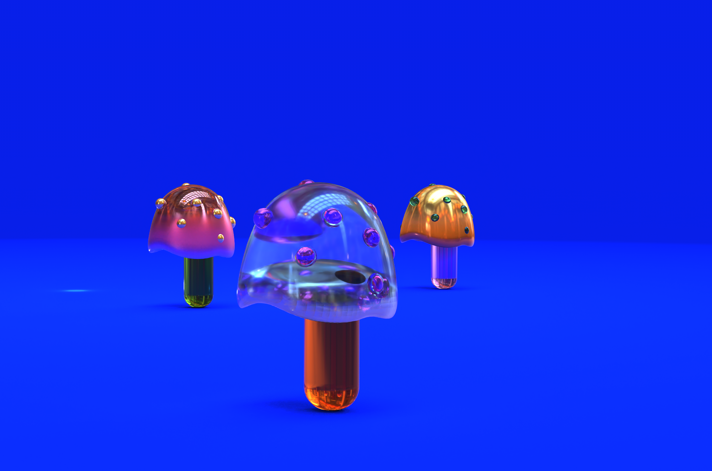

hide:
    - toc
---

# **Prototyping for Design**

# Digital Prototyping (19 Apr)

Robots - there are many types of robots, even a Roomba is a robot.

Robotic arm

Has much more precision and time saving than a human operators. Increasing the production in less time.

The robotic arm doesn’t have a defined job like a laser cutting, 3d printer or CNC, so it can be tweaked to do many things.

degree of freedom - the number of movable motions in the robot.

work envelope - all the space a robot can reach.

payload - the amount of weight of robot can handle at full arm. extrusion and moving at full speed.

number of axis = number of joineries

3d printer, chain saw, CNC, metal bending, pick & place robot, add a drone, carving, spraying

Types of movements

POLAR

CYLINDRICAL

CARTESIAN

JOINTED ARM

SCARA

2cp - two centre point

coordination - World CS | Robot CS | Base CS | Tool CS

end effector - tool for the robotic arm

Every time you change the tool, you need to calibrate because the TCP changes.

### (20 Apr) **Blender**

The tools that we use, shape us and the things we do.

In digital tools, you let the tools guide you - you feel a sense of freedom and you are the most creative. But otherwise a tool has a defined purpose to do one specific thing.

Free software vs Open Source

Free software - you earlier had the right to sell the code of the software

Open source - you have the licence to use it but you don’t have the right to sell it, there are certain conditions.

Share-alike - if you modify the free software, and choose to distribute it - you are forced to follow the same licence.

G - for moving stuff, it means grab

S - scaling the object

# Blender Exploration

  <iframe loading="lazy" style="position: absolute; width: 100%; height: 100%; top: 0; left: 0; border: none; padding: 0;margin: 0;"
    src="https:&#x2F;&#x2F;www.canva.com&#x2F;design&#x2F;DAFlonKA5hU&#x2F;watch?embed" allowfullscreen="allowfullscreen" allow="fullscreen">
  </iframe>

<a href="https:&#x2F;&#x2F;www.canva.com&#x2F;design&#x2F;DAFlonKA5hU&#x2F;watch?utm_content=DAFlonKA5hU&amp;utm_campaign=designshare&amp;utm_medium=embeds&amp;utm_source=link" target="_blank" rel="noopener">Design</a>

#Womp Open Software Exploration

  <iframe loading="lazy" style="position: absolute; width: 100%; height: 100%; top: 0; left: 0; border: none; padding: 0;margin: 0;"
    src="https:&#x2F;&#x2F;www.canva.com&#x2F;design&#x2F;DAFlohBF-zU&#x2F;watch?embed" allowfullscreen="allowfullscreen" allow="fullscreen">
  </iframe>

<a href="https:&#x2F;&#x2F;www.canva.com&#x2F;design&#x2F;DAFlohBF-zU&#x2F;watch?utm_content=DAFlohBF-zU&amp;utm_campaign=designshare&amp;utm_medium=embeds&amp;utm_source=link" target="_blank" rel="noopener">Design</a>

# Microchallenge (16 May)

**Design and create a digital interface to connect users and systems**

- define the interaction protocols
- define your digital system

Explain how it relates to collective intelligence seminar (Web3)

sensor device > processing system to send the g-code > to the machine to write the pattern

Nomadic Box - audio NFT platforms?

**ANDAAZA** - Audio Recording - archiving recipes - encrypting messages - NFTs

Echonest Pitch Visualiser

[p5-music-viz/sketch.js at master · therewasaguy/p5-music-viz](https://github.com/therewasaguy/p5-music-viz/blob/master/demos/08_echonestPitchSegment/sketch.js)

[Marius Watz | Artist archive](http://mariuswatz.com/)

[Abstract01.js - Marius Watz | Artist archive](http://gator3274.temp.domains/~mariuswa/2010/10/27/abstract01-js/)

  <iframe loading="lazy" style="position: absolute; width: 100%; height: 100%; top: 0; left: 0; border: none; padding: 0;margin: 0;"
    src="https:&#x2F;&#x2F;www.canva.com&#x2F;design&#x2F;DAFlXYr_ySI&#x2F;watch?embed" allowfullscreen="allowfullscreen" allow="fullscreen">
  </iframe>

<a href="https://seherkrishna02.github.io/Andaaza/">Andaaza Apna Apna Page - Recordings</a>

<a href="https://github.com/SeherKrishna02/Andaaza.git">Andaaza Github Page</a>
