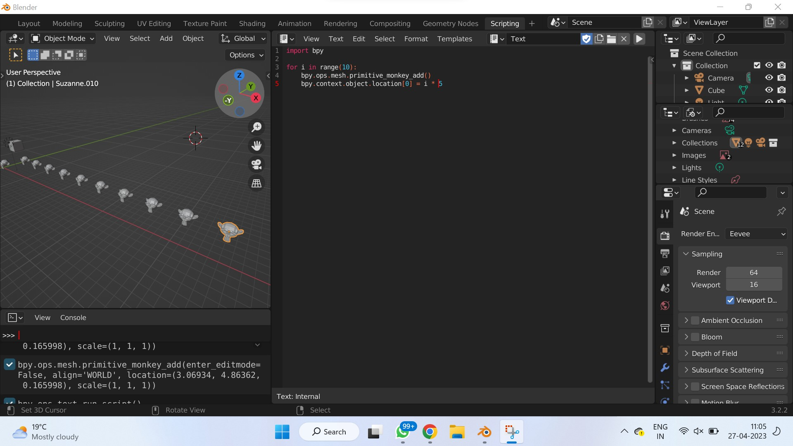
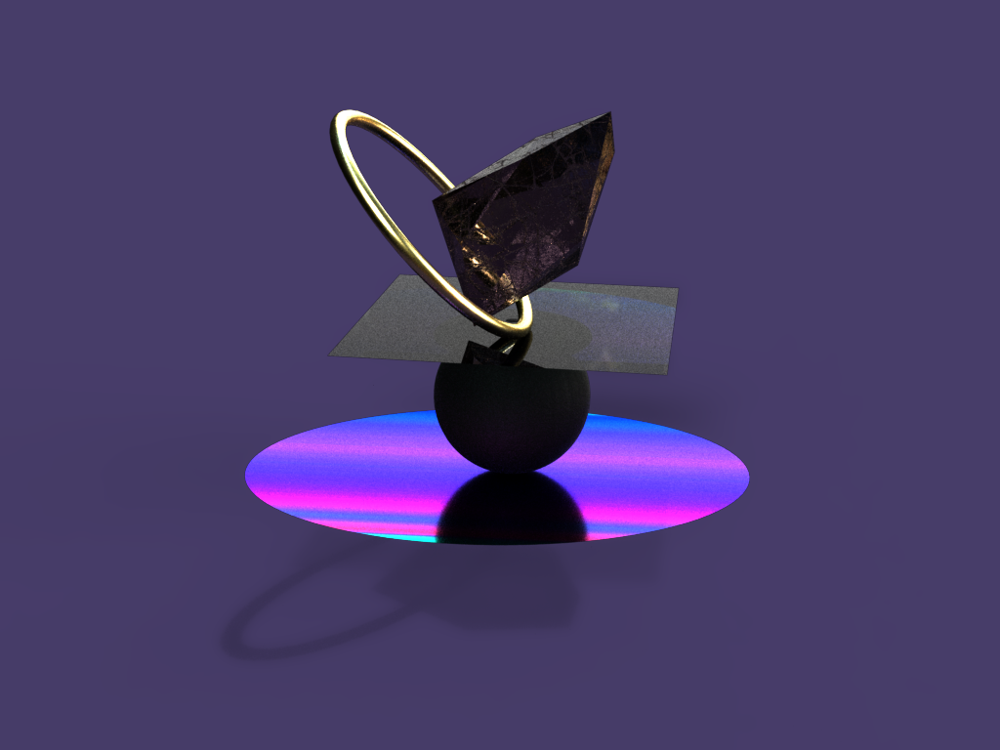
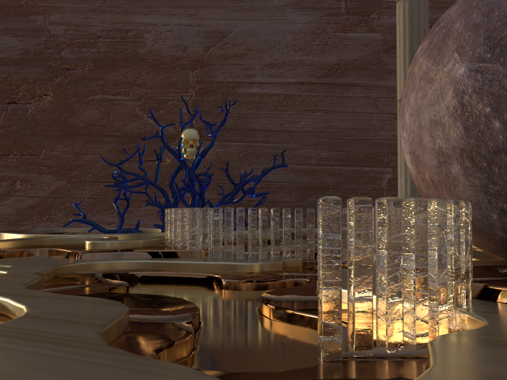
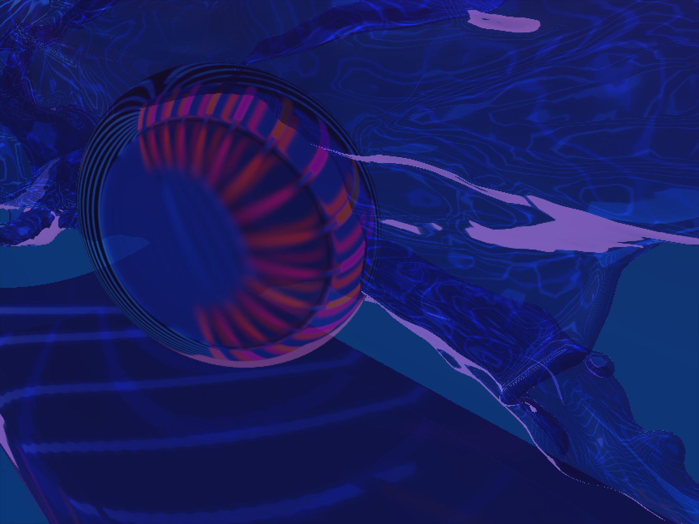

hide:
    - toc
---

# **Prototyping for Design**

# Digital Prototyping (19 Apr)

Robots - there are many types of robots, even a Roomba is a robot.

Robotic arm

Has much more precision and time saving than a human operators. Increasing the production in less time.

The robotic arm doesn’t have a defined job like a laser cutting, 3d printer or CNC, so it can be tweaked to do many things.

degree of freedom - the number of movable motions in the robot.

work envelope - all the space a robot can reach.

payload - the amount of weight of robot can handle at full arm. extrusion and moving at full speed.

number of axis = number of joineries

3d printer, chain saw, CNC, metal bending, pick & place robot, add a drone, carving, spraying

Types of movements

POLAR

CYLINDRICAL

CARTESIAN

JOINTED ARM

SCARA

2cp - two centre point

coordination - World CS | Robot CS | Base CS | Tool CS

end effector - tool for the robotic arm

Every time you change the tool, you need to calibrate because the TCP changes.

# Reflection on Robots

In this session, we began our exploration of modern robot arms. We learned about the different types of robot arms currently in use, including their motor systems and the number of axes they possess. We also discussed the various end effectors that can be attached to these arms, expanding their functionality. We looked at practical techniques and applications commonly associated with robotic arms, such as 3D printing, milling, cutting, and automation. These processes play a significant role in harnessing the capabilities of robotic arms.

We were then introduced to one of the IAAC robotic arms, this class was dedicated to understanding how to prepare robotic arm files using Grasshopper. Through this software, we discovered how to simulate movements and manipulate parameters using scripts. This allowed us to gain a better understanding of the control and modification possibilities within robotic arm design. The session ended with a hands-on activity. we utilized the robotic arm to print the letters "MDEF." This helped us to showcase what we had learned and further reinforced our understanding of working with robotic arms.

### (20 Apr) **Blender**

The tools that we use, shape us and the things we do.

In digital tools, you let the tools guide you - you feel a sense of freedom and you are the most creative. But otherwise a tool has a defined purpose to do one specific thing.

Free software vs Open Source

Free software - you earlier had the right to sell the code of the software

Open source - you have the licence to use it but you don’t have the right to sell it, there are certain conditions.

Share-alike - if you modify the free software, and choose to distribute it - you are forced to follow the same licence.

G - for moving stuff, it means grab

S - scaling the object

# Reflection on Blender

After getting the basics in the last blender session, we were introduced to python in blender. Python is a progammimg language that can also be used as a way to design in Blender. We tried some basic tools in blender using python such as array:

We then connected a Led strip light and connected it to blender where with the movement of the mouse as a sensor, the led lights blinked and moved in the same direction. It was interesting to see how you can see the interfaces interact to explore electronics. I enjoyed trying the open source modelling softwares a lot. It really helps overcome the complexity of a software and was a very user-friendly experience personallY. I have previously tried using Adobe Dimension to create some images of dreamscapes.

  <iframe loading="lazy" style="position: absolute; width: 100%; height: 100%; top: 0; left: 0; border: none; padding: 0;margin: 0;"
    src="https:&#x2F;&#x2F;www.canva.com&#x2F;design&#x2F;DAFl5B3tQ3M&#x2F;watch?embed" allowfullscreen="allowfullscreen" allow="fullscreen">
  </iframe>

<a href="https:&#x2F;&#x2F;www.canva.com&#x2F;design&#x2F;DAFl5B3tQ3M&#x2F;watch?utm_content=DAFl5B3tQ3M&amp;utm_campaign=designshare&amp;utm_medium=embeds&amp;utm_source=link" target="_blank" rel="noopener">LED lights + Blender</a>

# Blender Exploration

  <iframe loading="lazy" style="position: absolute; width: 100%; height: 100%; top: 0; left: 0; border: none; padding: 0;margin: 0;"
    src="https:&#x2F;&#x2F;www.canva.com&#x2F;design&#x2F;DAFlonKA5hU&#x2F;watch?embed" allowfullscreen="allowfullscreen" allow="fullscreen">
  </iframe>

<a href="https:&#x2F;&#x2F;www.canva.com&#x2F;design&#x2F;DAFlonKA5hU&#x2F;watch?utm_content=DAFlonKA5hU&amp;utm_campaign=designshare&amp;utm_medium=embeds&amp;utm_source=link" target="_blank" rel="noopener">Design</a>

#Womp Open Software Exploration

  <iframe loading="lazy" style="position: absolute; width: 100%; height: 100%; top: 0; left: 0; border: none; padding: 0;margin: 0;"
    src="https:&#x2F;&#x2F;www.canva.com&#x2F;design&#x2F;DAFlohBF-zU&#x2F;watch?embed" allowfullscreen="allowfullscreen" allow="fullscreen">
  </iframe>

<a href="https:&#x2F;&#x2F;www.canva.com&#x2F;design&#x2F;DAFlohBF-zU&#x2F;watch?utm_content=DAFlohBF-zU&amp;utm_campaign=designshare&amp;utm_medium=embeds&amp;utm_source=link" target="_blank" rel="noopener">Design</a>

# Microchallenge (16 May)

**Design and create a digital interface to connect users and systems**

- define the interaction protocols
- define your digital system

Explain how it relates to collective intelligence seminar (Web3)

sensor device > processing system to send the g-code > to the machine to write the pattern

Nomadic Box - audio NFT platforms?

**ANDAAZA** - Audio Recording - archiving recipes - encrypting messages - NFTs

Echonest Pitch Visualiser

[p5-music-viz/sketch.js at master · therewasaguy/p5-music-viz](https://github.com/therewasaguy/p5-music-viz/blob/master/demos/08_echonestPitchSegment/sketch.js)

[Marius Watz | Artist archive](http://mariuswatz.com/)

[Abstract01.js - Marius Watz | Artist archive](http://gator3274.temp.domains/~mariuswa/2010/10/27/abstract01-js/)

  <iframe loading="lazy" style="position: absolute; width: 100%; height: 100%; top: 0; left: 0; border: none; padding: 0;margin: 0;"
    src="https:&#x2F;&#x2F;www.canva.com&#x2F;design&#x2F;DAFlXYr_ySI&#x2F;watch?embed" allowfullscreen="allowfullscreen" allow="fullscreen">
  </iframe>

<a href="https://seherkrishna02.github.io/Andaaza/">Andaaza Apna Apna Page - Recordings</a>

<a href="https://github.com/SeherKrishna02/Andaaza.git">Andaaza Github Page</a>
