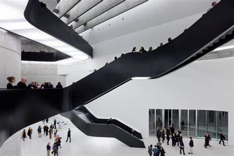

hide:
    - toc
---

# **Design Ethics**

# Design Ethics (21 Apr) - Ariel

technology is not what is new or digital or that which has a chip.

you make mirrors where facial care is valued. so you make tools that enable you to do that.

human knowledge is driven by human value.

Things frowned upon in terms of technology -

plastic wrap technology

golf carts

chatGPT for literature review

mirrors being covered by jews while mourning

Technological texture to life - comes through by artefacts - like radio, blanket, toothbrush, lamp etc.

Technology shows us what a society, a community or a group with power values as positive and what is undesirable and should be avoided,

Technology also tells us what is good and what is to be avoided.

What values are embedded into a shower head? - Convenience, hygiene(purity), water saving device,

Technology as singular - is a phenomenon

A constellation of knowledge, processes, skills and products whose aim is to control and perform - technology as a plural

Two opposed visions of tech -

(1) Technological neutrality - guns don’t kill people, people kill people

A gun doesn’t have free will, what is the purpose a gun was made? Supposedly to protect lives.

Samsung Gun

[Samsung SGR-A1 | Military Wiki | Fandom](https://r.search.yahoo.com/_ylt=AwrIe.tBT0JkEXAL8eu_.wt.;_ylu=Y29sbwMEcG9zAzQEdnRpZAMEc2VjA3Ny/RV=2/RE=1682096065/RO=10/RU=https://military-history.fandom.com/wiki/Samsung_SGR-A1/RK=2/RS=BQIO.583TNm9NUhUmrrr1yKKRWA-)

But a gun does codeine a situation and what is possible and what isn’t. A gun isn’t just an instrument, a gun is not neutral.

[Parvin_JustDesign_PastsPresentsandFutureTrajectoriesofTechnologyJustTech.pdf](Design%20Ethics%20(21%20Apr)%20-%20Ariel%20882103d8a5d047598d75d74acda119b1/Parvin_JustDesign_PastsPresentsandFutureTrajectoriesofTechnologyJustTech.pdf)

Technology is the agent of social change as it moulds society and changes our behaviour.

The concept of being close to something is dependant to what technology you have and where you live. Technology participates in our decision making, because of that technology has a moral dimension.

Is ethics a purely human affair?

Designer’s fantasy - blue ticks on WhatsApp. it was designed in a particular manner but it created many more things.

The Angelina Effect - without the technology of screening, she couldn't have made the decision of a double mastectomy.

Genetic screening on IVFs

[‘Hipster eugenics’: why is the media cosying up to people who want to build a super race?](https://www.theguardian.com/lifeandstyle/2023/apr/20/pro-natalism-babies-global-population-genetics?ref=upstract.com)

[The Volkswagen scandal in not an ethical issue](https://insideuni.uni.edu/business/volkswagen-scandal-not-ethical-issue)

[Ford Pinto: Explosive Story Of An Ugly '70s Subcompact Car](https://groovyhistory.com/everybody-had-a-pinto-the-car-of-the-70s)

Embodiment relation of mediation

human + technology = world

Glasses - if a person always wears glasses or contacts then it is always relevant in their perception of the world. Even when you're driving a car or a skateboard, the whole technology becomes a part of you. The rear of the car becomes like your literal back.

[EPC / Paul Blackburn - Translation - Julio Cortázar - "The Instruction Manual"](https://writing.upenn.edu/epc/authors/blackburn/blackburn_translation_cortazar_cronopios.html)

Hermeneutic relation

human = technology

A thermometer, example the weather app, you’re just reading the number but you don’t get the sense of what it is. you need to decode the representation of the world.

Digital Twin - tomato and of human’s for the sake of medicine advancement which is useful as you use less resources, less harm and you don’t have to test on animals then.

But creating digital twin to predict crime by creating digital twin of people from crime dense neighbourhoods, it’s never going to work. Its not accurate.

Cyborg relation

pacemaker, deep brain stimulation

[IHDTAT-3.1.docx](Design%20Ethics%20(21%20Apr)%20-%20Ariel%20882103d8a5d047598d75d74acda119b1/IHDTAT-3.1.docx)

Eugenics - the study of how to arrange reproduction within a human population to increase the occurrence of [heritable](https://www.google.com/search?client=safari&rls=en&sxsrf=APwXEdeooTwzHa4eege9XS03D_edhgN1NA:1682073776582&q=heritable&si=AMnBZoFEI0LGJdD1jElhAGFwRnmoQsrteZG-IyrfdqKTVEysKfdxKQY12qEjWWFgR3TpD37TwXZFUW7HWJxg6C44EuIdjltTrA%3D%3D&expnd=1), characteristics regarded as desirable.

Jevon’t paradox - when fuel efficient technology is developed, you just use more of that technology so it is then matches the same amount of fuel. Example with led lights, we are just using them more and they are always on.

Stabilities and their effects are not easy to predict. Technology responds to social forces.

The creation of these technologies - Washing machine, hoover set new standard of cleanliness.

Techno-solutionism - to describe the problem in a very simple way to show how technology will solve the issue. A naïve belief that any problem can be solved by applying a magic technology box and that the application of technology will change society for the better. Techno-solutionism treats technological advancement as inherently good.

How are the values materialised into a design?

The clinical purity of a hospital in a baby product like a white cradle, or the environmental effects of having products that are going to be used only for a few months and aren’t modular.

______________________________________________________________________________

(28 Apr)

Stabilities and their effect are not easy to predict.

Technology responds to social forces.

social roles, social division and opposition of ‘productive’ and ‘reproductive’

Productive - you get money

Reproductive - you don’t get money for it.

After WW2, the ‘male breadwinner model’ - emerged due to there being more money, so bigger houses and so the role of a home maker emerged.

In architecture, the way houses then began have private spaces like a tiny kitchen in a tiny house.

Normative - when you use something and that makes you behave in a certain way. Example, the way a chair is designed, you need to sit in a certain position in it. It forces you to behave like that.

spoon, bowl, plate

By using design, it’s materialising notions of good and the right like less spillage. The nutch is the fly etched on the urinal.

Nudge - Richard H. thaler and Cass R. sunstein.

[[PDF] [EPUB] Nudge: The Final Edition Download](https://oceanofpdf.com/authors/richard-h-thaler/pdf-epub-nudge-the-final-edition-download-66352863688/)

Coersive- Apparent - metro card to enter | speed-bump - it physically makes you slow down

Seductive - hidden - urinal with fly ( design intervention is noticeably but the intention is not apparent).

Reclining office chair

Below the bridge, to prevent people from BBQ, crossing the road, homeless etc

Security check at shop entry-exit gate.

[https://destinationlancasterca.org/adventures/musical-road/#:~:text=The Musical Road is located,kind in the United States](https://destinationlancasterca.org/adventures/musical-road/#:~:text=The%20Musical%20Road%20is%20located,kind%20in%20the%20United%20States).

Design seeks to influence behaviour in a particular way, it’s never neutral.

Deontology - inspired by the Bible, holy book for islam and the Bible for the jews

Kant - categorical imperatives - act only accordingly that maximum whereby you can at the same time make it into a universal law. (eg, lying, killing) He was about principles.

humanity - to treat people not such as a means (tool) but also as an end (purpose)

Consequentialism - ethics of effects - J.S. Mill

Maximise happiness - greatest amount of good for the ‘greatest number’.

Calculate the effects of how much good.

TESCREAL - Silicon Valley

[Buen Vivir](https://filosofiadelbuenvivir.com/buen-vivir-2/)

[Muere Bruno Latour, filósofo de la ecología y uno de los pensadores franceses más influyentes](https://elpais.com/cultura/2022-10-09/muere-bruno-latour-filosofo-de-la-ecologia-y-uno-de-los-pensadores-franceses-mas-influyentes.html)

“we become what we behold. we shape our tools and they shape us.”

Similar to Eugenics

[APA PsycNet](https://psycnet.apa.org/doiLanding?doi=10.1037/pspa0000098)

Facial Recognition | Facial Analysis

Big 5 personality | Myer Briggs - both easy to implement and racist

design is the creation, specifications for an artefact. In a broader sense, it is about conceiving and reconfiguring ways of being, living and doing.

broader sense is that everyone designs, for example when rearranging objects in your house. Narrow way is that design is a practice, profession or as an occupation.

Often cited criteria to design

- Extensive training
- Intellectual component
- Commitment to a key human good.

[https://arl.human.cornell.edu/linked docs/Illich_Tools_for_Conviviality.pdf](https://arl.human.cornell.edu/linked docs/Illich_Tools_for_Conviviality.pdf)

Design is a profession if they're a key human good. Like how being a doctor is about health and a nurse is about health and care. So what is design about?

Caring about < Caring for because you can care about a lot of things. But designing with care is about responsibility, capabilities.

MACBA(caring about all the different kinds of people who will visit the museum) vs. Maxxi museum by Zaha hadid (restricts the kind of people who can access the building the easily)

design is a cooperative collaborative practice with shared methods, tradition, disputes. It’s about what should we do, no what should I do.

“less is more but less is also a bore”

The goods of design (professional ethics for designer) - Ariel
