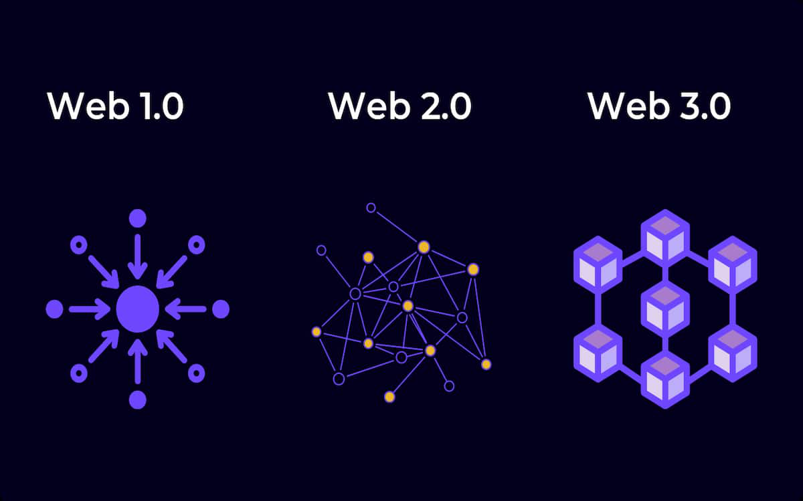

hide:
    - toc
---

# **Decentralised Autonomous Organisations**

Unfolding the foundation behind big tech

Explore emergent and alternative tech, from narrative, implementation and application point of view.

Provide tools and methods for rapid prototyping of artefacts.

Get familiar with fab lab  mindset, ecosystem and resources.

Design interfaces to abstract technologies - especially when you are talking about digitising interfaces.

A mailman - messenger that then became a fax machine or sending emails.

How radical is it that on the web by default you can select and copy text.

Technologies are cultural artefacts

***Decolonizing Technology  -***

1.  ***from extractive to regenerative technologies***
2. ***from convenience to expression technologies***
3. ***from survival to rebel technologies (duck-duck-go instead of chrome)***

[sisters with transistors](https://sisterswithtransistors.com/)

How to identify what are technologies in terms of a scale and complexity graph.

- from a simple tool to even a city, it is all a technology because a city has a sewer system, roads etc.

Affordance | Black box | Programmed absence

Protocols Not Platforms

Zero-knowledge proof

[The Critical Engineering Manifesto](https://criticalengineering.org/)

[TECHNOREALISM](http://www.technorealism.org/)

[The Tarot Cards Of Tech](https://tarotcardsoftech.artefactgroup.com/)

[Psychedelic Forms - Varvara & Mar - Espacio Open](https://espacioopen.com/psychedelic-forms/)

[Psychedelic Forms - Varvara Guljajeva y Mar Canet](https://youtu.be/TeJIARYsRnc)

RFC - request for commons - it's a file with the standards for a protocol.

___________________________________________________________________________________

### (10 May) Mar Canet Solà - Collective intelligence NFT Workshop

[Artworks](https://var-mar.info/)

Protopixel :

[Made with ProtoPixel](https://www.protopixel.io/showcase)

[AI-Aided Ceramic Sculptures: Bridging Deep Learning with Materiality | Request PDF](https://www.researchgate.net/publication/369797044_AI-Aided_Ceramic_Sculptures_Bridging_Deep_Learning_with_Materiality)

[(PDF) Keep Smiling](https://www.researchgate.net/publication/367607098_Keep_Smiling)

[https://twitter.com/mcanet/status/1563119090499104768](https://twitter.com/mcanet/status/1563119090499104768)

1. Introduction
2. Background & History
3. Ethereal and the rise of smart contracts
4. Non-fungible tokens
5. Interesting NFTs
6. Marketplaces
7. Wallets & Strategy

Cryptocurrency is Bitcoin

[The Artificial Intelligence Revolution: Part 1 - Wait But Why](https://waitbutwhy.com/2015/01/artificial-intelligence-revolution-1.html)

Many jobs will need retraining to learn all these new softwares and tools. You won't be replaced by AI but probably by someone who uses AI.

Services are eating the software - How many software subscriptions do you pay every month?

Spotify, Adobe Suite, iCloud storage, Apple TV, Netflix, Apple Music,

**10 Industries that blockchain will disrupt in future**

1. Banking
2. Cybersecurity
3. Supply chain management
4. Healthcare
5. Government
6. Insurance
7. Transportation
8. Cloud storage
9. Real estate
10. Art and design

Blockchain is a secure system to store data. It is a public data base and is anonymous but linked to wallets account. It is a software in a way, with updates.

Bitcoin is still ecologically polluting.

Estonia has their own blockchain system. It is the most digitally advanced country.

Every time you save something in the blockchain, depending on which blockchain - the gas fees is different. The number of transactions allowed on the blockchain is still limited.

Conspiracy around the founder of Bitcoin - Satoshi Nakamoto

[https://www.google.com/search?client=safari&rls=en&q=satoshi+nakamoto&ie=UTF-8&oe=UTF-8https://www.google.com/search?client=safari&rls=en&q=satoshi+nakamoto&ie=UTF-8&oe=UTF-8](https://www.google.com/search?client=safari&rls=en&q=satoshi+nakamoto&ie=UTF-8&oe=UTF-8)

[How quantum computers work: Explaining qubits to quantum superposition](https://youtu.be/WW7DKcrQ-7E)

Distribute system vs Centralised System

Blockchain in theory is decentralised.

Solidity was the first language produced for blockchain for Ethereum

Visualtez is a software used for writing smart contracts for Tezos

Miners - what do they do? what does it mean to mine a bitcoin?

Hardware wallet & Cold wallet

It's an offline way of smart contracts with a safe word and password

Fungible tokens (sliceable - you can send someone 0.0001 % of 1 bitcoin)

Semi-fungible tokens

Non-fungible tokens

[The Casino-Chip Society](https://brettscott.substack.com/p/casino-chip-cashless-society?utm_source=substack&publication_id=69390&post_id=83312237&utm_medium=email&utm_content=share&triggerShare=true&isFreemail=true)

[Altered States of Monetary Consciousness](https://alteredstatesof.money/)

# Reflection

I'm not sure if I would use the blockchain to store NFTs and if we really need them. If I were to ever use it, I would like to explore the creative aspect and store a series of Nature's Kaleidoscope on it. It is a series of images created by me, and I feel as the ever changing nature of our environment and plants around us can never be replicated exactly the same. Similar to the nature of visuals generated while using a traditional kaleidoscope. My understanding of what can be considered an NFT, by looking at artworks created as NFTs are that they are quite complex and cannot be replicated exactly the same by someone else and that is the reason why people would like to purchase them and own something truly unique and special. I was not able to attend the final presentation but learnt how to set up a Tezos wallet and explored the idea of creating NFTs.

  <iframe loading="lazy" style="position: absolute; width: 100%; height: 100%; top: 0; left: 0; border: none; padding: 0;margin: 0;"
    src="https:&#x2F;&#x2F;www.canva.com&#x2F;design&#x2F;DAFlotOX_wk&#x2F;view?embed" allowfullscreen="allowfullscreen" allow="fullscreen">
  </iframe>

<a href="https:&#x2F;&#x2F;www.canva.com&#x2F;design&#x2F;DAFlotOX_wk&#x2F;view?utm_content=DAFlotOX_wk&amp;utm_campaign=designshare&amp;utm_medium=embeds&amp;utm_source=link" target="_blank" rel="noopener">Nature's Kaleidoscope</a>
